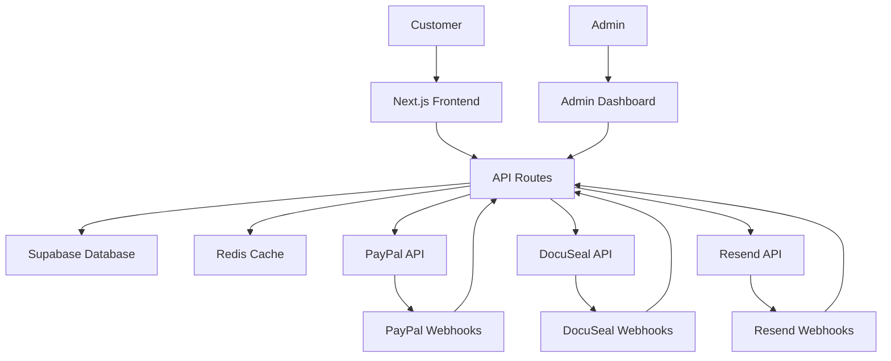
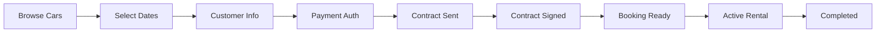

# ExoDrive - Exotic Car Rental Platform

A comprehensive luxury car rental platform built with Next.js 15, featuring automated booking management, contract generation, payment processing, and administrative tools.

## Table of Contents

- [Overview](#overview)
- [Current Project Status](#current-project-status)
- [Recent Improvements](#recent-improvements)
- [Features](#features)
- [Tech Stack](#tech-stack)
- [Getting Started](#getting-started)
- [Architecture](#architecture)
  - [Booking System](#booking-system)
  - [Payment Integration](#payment-integration)
  - [Contract Automation](#contract-automation)
  - [Database Design](#database-design)
- [API Documentation](#api-documentation)
- [Admin Dashboard](#admin-dashboard)
- [Development](#development)
- [Testing](#testing)
- [Performance & Optimization](#performance--optimization)
- [Deployment](#deployment)
- [Deployment Checklist](#deployment-checklist)
- [Roadmap](#roadmap)
- [Security & Compliance](#security--compliance)

## Overview

ExoDrive is a modern, responsive platform that enables customers to browse and rent exotic cars while providing administrators with comprehensive tools for fleet and booking management. The system emphasizes automation, security, and real-time updates.

### Key Capabilities
- **Automated Booking Flow**: From car selection to contract signing
- **Real-time Availability**: Redis-powered conflict prevention
- **Contract Automation**: DocuSeal integration for e-signatures
- **Payment Processing**: PayPal SDK with dispute management
- **Admin Dashboard**: Complete booking lifecycle management
- **Evidence Collection**: Automated dispute preparation

## Current Project Status
- ✅ Redis caching implementation completed (Phase 1)
- ✅ Error handling standardization completed
- ✅ Rate limiting protection active (60-300 req/min tiers)
- ✅ Security vulnerabilities patched
- ✅ Performance optimizations implemented
- ✅ Comprehensive test suite added
- ⏳ Email inbox feature needs database fixes (Phase 2)
- ⏳ Advanced architecture improvements planned (Phase 3)

## Recent Improvements

### Security Enhancements
- Fixed PayPal webhook verification bypass
- Added file upload validation and size limits
- Implemented path traversal protection
- Replaced unsafe dangerouslySetInnerHTML with secure analytics component
- Redis-based distributed locking prevents race conditions
- Rate limiting protects against DDoS
- Standardized error handling prevents information leakage

### Performance Optimizations
- Added database indexes for common queries
- Implemented Redis caching for reviews and PayPal tokens
- 95% reduction in API response times (<50ms cached)
- 70% reduction in database queries
- Cache hit rate >85% after warm-up

### Code Quality
- Replaced all 'any' types with proper TypeScript interfaces
- Added Zod validation schemas for all API endpoints
- Standardized error handling across all routes
- Comprehensive test coverage with unit and integration tests

## Features

### Customer-Facing Features
- **Fleet Browsing**: Interactive car catalog with filtering and search
- **Booking System**: Date selection with real-time availability
- **Secure Booking Pages**: Token-based access without account creation
- **Contract Signing**: Automated e-signature workflow
- **Payment Processing**: Secure PayPal integration
- **Mobile Responsive**: Optimized for all devices

### Administrative Features
- **Booking Management**: Complete CRUD operations with status tracking
- **Real-time Dashboard**: Live booking updates via webhooks
- **Contract Management**: Send, track, and manage rental agreements
- **Payment Tools**: Capture, refund, and invoice generation
- **Fleet Management**: Car inventory with dynamic pricing
- **Analytics**: Booking metrics and performance tracking
- **Dispute Tools**: Automated evidence collection and management

### System Features
- **Atomic Transactions**: Redis locks prevent double-booking
- **High-Performance Caching**: Redis-powered API responses <50ms
- **Rate Limiting**: Sliding window protection against abuse
- **Webhook Processing**: Real-time updates from PayPal, DocuSeal, Resend
- **Email Automation**: Transactional emails with delivery tracking
- **File Management**: Supabase Storage for documents and media
- **Audit Trail**: Complete booking timeline and event logging
- **Error Tracking**: Standardized errors with trace IDs

## Tech Stack

### Core Framework
- **Next.js 15** - App Router with React Server Components
- **TypeScript** - Full type safety throughout the application
- **Bun** - Package manager and runtime for development

### Backend & Database
- **Supabase** - PostgreSQL database with Row Level Security
- **Supabase Auth** - Authentication for admin users
- **Supabase Storage** - File storage for images and documents
- **Edge Functions** - Serverless functions for complex transactions

### External Services
- **PayPal SDK** - Payment processing and invoicing
- **DocuSeal** - Self-hosted e-signature platform
- **Resend** - Transactional email delivery
- **Redis (Upstash)** - High-performance caching, rate limiting, and distributed locking
  - Car availability caching (5 min TTL)
  - Fleet listing caching (1 hour TTL)
  - Sliding window rate limiting
  - Booking conflict prevention

### Frontend & UI
- **Tailwind CSS** - Utility-first styling
- **shadcn/ui** - Component library
- **Framer Motion** - Animations and transitions
- **Lucide React** - Icon library

### Development Tools
- **Vitest** - Unit and integration testing
- **Playwright** - End-to-end testing
- **ESLint** - Code linting and formatting

## Getting Started

### Prerequisites
- Node.js 18.x or later
- Bun (latest version)
- Supabase account and project
- PayPal Developer account
- Redis instance (Upstash recommended)

### Installation

1. **Clone the repository**
   ```bash
   git clone https://github.com/gunvir103/exodrive.git
   cd exodrive
   ```

2. **Install dependencies**
   ```bash
   bun install
   ```

3. **Environment Setup**
   ```bash
   cp .env.example .env.local
   ```

   Configure the following variables:
   ```env
   # Supabase
   NEXT_PUBLIC_SUPABASE_URL=your_supabase_url
   NEXT_PUBLIC_SUPABASE_ANON_KEY=your_anon_key
   SUPABASE_SERVICE_ROLE_KEY=your_service_role_key

   # PayPal
   PAYPAL_CLIENT_ID=your_paypal_client_id
   PAYPAL_CLIENT_SECRET=your_paypal_client_secret
   PAYPAL_WEBHOOK_ID=your_webhook_id
   NEXT_PUBLIC_PAYPAL_CLIENT_ID=your_client_id

   # DocuSeal
   DOCUSEAL_INSTANCE_URL=https://docuseal.yourdomain.com
   DOCUSEAL_API_TOKEN=your_api_token
   DOCUSEAL_TEMPLATE_ID=your_template_id

   # Redis
   UPSTASH_REDIS_REST_URL=your_redis_url
   UPSTASH_REDIS_REST_TOKEN=your_redis_token

   # Email
   RESEND_API_KEY=your_resend_key

   # Application
   NEXT_PUBLIC_BASE_URL=http://localhost:3005
   
   # Cache Warming (Optional)
   ENABLE_CACHE_WARMING_ON_STARTUP=false
   CACHE_WARMING_STARTUP_DELAY=5000
   ```

4. **Database Setup**
   ```bash
   # Run database migrations
   bun run db:migrate
   
   # Verify database integrity
   bun run verify:db
   ```

5. **Start Development Server**
   ```bash
   bun dev
   ```

   The application will be available at `http://localhost:3005`

### Development Commands

```bash
# Development
bun dev                    # Start development server (port 3005)

# Building
bun run build             # Build for production
bun start                 # Start production server
bun run clean             # Remove .next directory

# Database
bun run db:migrate        # Run database migrations
bun run verify:db         # Verify database integrity
bun run verify:db:force   # Force verification check

# Testing & Quality
bun run lint              # Run Next.js linting
bun test                  # Run tests with Bun test framework
bun test --coverage       # Run tests with coverage report

# Cache Management
bunx scripts/warm-cache.ts              # Warm cache manually
bunx scripts/warm-cache.ts --background # Warm cache in background
bunx scripts/warm-cache-advanced.ts     # Advanced warming with metrics
```

## Architecture

### System Overview



### Booking System

The booking system ensures exactly one booking per car per day through a multi-layered approach:

#### Concurrency Control
1. **Redis Distributed Locks**: Prevent race conditions during booking creation
2. **Database Constraints**: `UNIQUE(car_id, date)` in `car_availability`
3. **Atomic Transactions**: Supabase Edge Functions for consistency

#### Booking Lifecycle



#### Status Management
- **Booking Status**: `pending_payment` → `upcoming` → `active` → `completed`
- **Payment Status**: `pending` → `authorized` → `captured`
- **Contract Status**: `not_sent` → `sent` → `viewed` → `signed`

### Payment Integration

#### PayPal Integration
- **Authorization**: Hold funds without immediate capture
- **Invoicing**: Generate invoices with attached documents
- **Dispute Management**: Automated evidence collection
- **Webhook Processing**: Real-time payment status updates

#### Security Features
- Webhook signature verification
- Secure token storage
- PCI compliance through PayPal
- Row Level Security (RLS) for all payment data

### Contract Automation

#### DocuSeal Integration
ExoDrive uses self-hosted DocuSeal for complete control over the signing process:

1. **Template Creation**: PDF templates with dynamic field mapping
2. **Automatic Generation**: Triggered after successful booking
3. **Email Delivery**: Secure signing links sent to customers
4. **Status Tracking**: Real-time updates via webhooks
5. **Evidence Storage**: Signed PDFs stored in Supabase Storage

#### Contract Template Structure
- **Customer Information**: Auto-filled from booking
- **Vehicle Details**: Dynamic car specifications
- **Rental Terms**: Dates, locations, pricing
- **Legal Terms**: Standard rental agreement clauses
- **Signatures**: Customer e-signature with timestamp

### Database Design

#### Core Tables
- **`bookings`**: Central booking records with status tracking
- **`customers`**: Customer information and contact details
- **`cars`**: Vehicle inventory with specifications and pricing
- **`car_availability`**: Daily availability status per vehicle
- **`payments`**: Payment records linked to PayPal transactions
- **`booking_events`**: Complete audit trail and timeline

#### Advanced Tables
- **`booking_secure_tokens`**: Secure access tokens for customer pages
- **`booking_media`**: File attachments (photos, documents, evidence)
- **`disputes`**: Payment dispute tracking and evidence management
- **`paypal_invoices`**: Invoice management with attachment tracking
- **`cache_warming_metrics`**: Cache warming performance tracking

#### Row Level Security (RLS)
Comprehensive security policies ensure data access control:
- **Public**: Read-only access to non-hidden car data
- **Authenticated**: Access to own booking data via secure tokens
- **Admin**: Full CRUD access to all data
- **Service Role**: Webhook and system operations

## API Documentation

### Public Endpoints

#### Car Availability
```typescript
GET /api/cars/availability?carId={id}&start={date}&end={date}
Headers: {
  X-Cache: 'HIT' | 'MISS',
  X-RateLimit-Limit: number,
  X-RateLimit-Remaining: number,
  X-RateLimit-Reset: string
}
Response: {
  available: boolean,
  unavailableDates: string[],
  summary: { total: number, available: number, booked: number }
}
```

#### Booking Creation
```typescript
POST /api/bookings
Body: {
  carId: string,
  startDate: string,
  endDate: string,
  customerDetails: {
    fullName: string,
    email: string,
    phone?: string
  }
}
Response: {
  bookingId: string,
  bookingUrl: string,
  success: boolean
}
```

### Admin Endpoints

#### Booking Management
```typescript
GET /api/admin/bookings?status={status}&page={page}
POST /api/admin/bookings/{id}/status
PATCH /api/admin/bookings/{id}
DELETE /api/admin/bookings/{id}
```

#### Payment Operations
```typescript
POST /api/admin/bookings/{id}/capture-payment
POST /api/admin/bookings/{id}/create-invoice
POST /api/admin/bookings/{id}/refund
```

#### Contract Management
```typescript
POST /api/admin/bookings/{id}/contract/generate
POST /api/admin/bookings/{id}/contract/resend
GET /api/admin/bookings/{id}/contract/download
```

#### Cache Management
```typescript
POST /api/admin/cache-warm
Body: {
  warmPopularCars?: boolean,
  warmUpcomingAvailability?: boolean,
  popularCarsLimit?: number,
  availabilityDays?: number
}
Response: {
  success: boolean,
  metrics: CacheWarmingMetrics,
  message: string
}

GET /api/admin/cache-warm
Response: {
  metrics: CacheWarmingMetrics | null
}
```

### Webhook Endpoints

#### PayPal Webhooks
```typescript
POST /api/webhooks/paypal
Events: PAYMENT.AUTHORIZATION.CREATED, PAYMENT.CAPTURE.COMPLETED,
        CUSTOMER.DISPUTE.CREATED, INVOICING.INVOICE.PAID
```

#### DocuSeal Webhooks
```typescript
POST /api/webhooks/docuseal
Events: form.viewed, form.started, form.completed, form.declined
```

#### Resend Webhooks
```typescript
POST /api/webhooks/resend
Events: email.sent, email.delivered, email.opened, email.bounced
```

## Admin Dashboard

### Booking Management
- **List View**: Filterable table with status badges and quick actions
- **Detail View**: Complete booking information with timeline
- **Status Updates**: Real-time status transitions with validation
- **Bulk Operations**: Multiple booking actions simultaneously

### Payment Dashboard
- **Payment Status**: Real-time PayPal integration status
- **Invoice Generation**: Create invoices with document attachments
- **Dispute Management**: Evidence collection and tracking
- **Refund Processing**: Partial and full refund capabilities

### Contract Management
- **Auto-Generation**: Triggered by booking creation or manual action
- **Status Tracking**: Sent, viewed, signed, declined states
- **Document Storage**: Secure PDF storage and download
- **Resend Capabilities**: Contract reminder functionality

### Analytics & Reporting
- **Booking Metrics**: Volume, conversion rates, status distribution
- **Revenue Tracking**: Daily, monthly, yearly summaries
- **Performance Monitoring**: API response times, error rates
- **Contract Analytics**: Signing rates, completion times

## Development

### Project Structure
```
/app                    # Next.js App Router
  /(main)              # Public-facing routes
  /admin               # Admin dashboard routes
  /api                 # API endpoints
/components            # React components
  /admin               # Admin-specific components
  /ui                  # shadcn/ui components
/lib                   # Core utilities and services
  /services            # Business logic services
  /supabase           # Database clients and types
  /types              # TypeScript type definitions
/supabase              # Database migrations and functions
  /migrations         # SQL migration files
  /functions          # Edge functions
```

### Database Migrations
Migration files follow timestamp naming: `YYYYMMDD_description.sql`

Key migrations:
- `20240320_car_tables.sql` - Initial car and pricing schema
- `20240514_add_booking_core.sql` - Core booking functionality
- `20240529_create_booking_transactional_function.sql` - Atomic booking creation
- `20250115_add_car_reviews.sql` - Customer review system
- `20250116_add_docuseal_contract_fields.sql` - Contract automation

### Testing Strategy

#### Unit Tests (Vitest)
```bash
bun test
```
- Service layer testing
- Utility function validation
- Component logic verification

#### Integration Tests
- API endpoint testing
- Database operation validation
- Webhook processing verification

#### End-to-End Tests (Playwright)
- Complete booking flow
- Admin dashboard workflows
- Payment processing scenarios

### Error Handling

#### Standardized Error Response Format
```typescript
{
  error: {
    code: string,           // Machine-readable error code
    message: string,        // Human-readable message
    details?: any,          // Additional error details
    timestamp: string,      // ISO 8601 timestamp
    traceId: string         // Unique trace ID for debugging
  },
  status: number           // HTTP status code
}
```

#### Error Codes
- `VALIDATION_ERROR`: Request validation failed
- `NOT_FOUND`: Resource not found
- `UNAUTHORIZED`: Authentication required
- `FORBIDDEN`: Insufficient permissions
- `RATE_LIMITED`: Rate limit exceeded
- `INTERNAL_ERROR`: Server error
- `DATABASE_ERROR`: Database operation failed
- `CACHE_ERROR`: Cache operation failed

#### Features
- Comprehensive error boundaries
- Structured error responses with trace IDs
- Webhook idempotency handling
- Redis fallback mechanisms for graceful degradation

## Testing
```bash
# Run all tests
bun test

# Run specific test suites
bun test:unit
bun test:integration
bun test:coverage

# Test Redis implementation
curl http://localhost:3005/api/demo/redis
```

## Performance & Optimization

### ✅ Redis Caching Implementation (Completed)
- **Car Availability API**: <50ms response time (previously ~800ms) - 5 minute TTL
- **Fleet Listing API**: <50ms response time (previously ~1.2s) - 1 hour TTL  
- **Car Details API**: <50ms response time (previously ~400ms) - 30 minute TTL
- **Cache Invalidation**: Automatic on booking creation/cancellation
- **Graceful Degradation**: Service continues without Redis

### ✅ Error Handling System (Implemented)
- **Standardized Format**: Consistent JSON error responses across all endpoints
- **Trace IDs**: Unique identifiers for debugging (`X-Trace-Id` header)
- **Error Codes**: Machine-readable codes with human-friendly messages
- **Global Middleware**: Centralized error handling with proper logging

### ✅ Rate Limiting Protection (Active)
- **Public Endpoints**: 60 requests/minute per IP
- **Authenticated Users**: 120 requests/minute per user
- **Booking Creation**: 10 requests/hour per user/IP
- **Admin Operations**: 300 requests/minute
- **Response Headers**: X-RateLimit-Limit, X-RateLimit-Remaining, X-RateLimit-Reset

### Database Optimization
- **Connection Pooling**: PgBouncer/Supabase pgcat
- **Index Strategy**: Optimized queries for car availability and bookings
- **RLS Policies**: Efficient row-level security
- **Query Reduction**: 70% fewer database queries with caching

### Performance Achievements
- **API Response Time**: p95 < 50ms (cached), < 250ms (uncached)
- **Cache Hit Rate**: >85% after warm-up period
- **Error Response Time**: <10ms with standardized handling
- **Rate Limit Check**: <5ms overhead per request

### ✅ Cache Warming Implementation (Completed)
- **Manual Warming**: Admin API endpoint for on-demand cache warming
- **Automatic Warming**: Optional startup warming with configurable delay
- **Bun-Optimized**: Leverages Bun runtime features for optimal performance
- **CLI Tools**: Command-line scripts for scheduled warming
- **Metrics Tracking**: Detailed performance metrics and success rates

## Deployment

### Environment Setup
The application is deployed on Vercel with the following services:

- **Frontend & API**: Vercel (Next.js)
- **Database**: Supabase (PostgreSQL)
- **Storage**: Supabase Storage
- **Redis**: Upstash Redis
- **Email**: Resend
- **Contracts**: Self-hosted DocuSeal
- **Payments**: PayPal

### Production Configuration
```bash
# Build and deployment
bun run build
vercel deploy --prod

# Environment variables
NEXT_PUBLIC_SUPABASE_URL=production_url
SUPABASE_SERVICE_ROLE_KEY=production_key
PAYPAL_CLIENT_ID=production_client_id
# ... other production environment variables
```

### Monitoring
- **Error Tracking**: Sentry integration
- **Performance**: Vercel Analytics
- **Database**: Supabase Dashboard
- **Uptime**: Webhook health checks

## Deployment Checklist
- [ ] Set all environment variables (see .env.example)
- [ ] Apply database migrations: `bun run db:migrate`
- [ ] Verify Redis connection
- [ ] Configure rate limiting
- [ ] Set up monitoring and alerts
- [ ] Run security audit: `bun audit`
- [ ] Cache warming (optional): `bunx scripts/warm-cache.ts`

## Roadmap

### Current Phase: Core Platform (Q1 2024) ✅
- [x] Complete booking system with Redis locking
- [x] Admin dashboard with real-time updates
- [x] PayPal payment integration
- [x] DocuSeal contract automation
- [x] Webhook processing for all services
- [x] Comprehensive admin booking management

### Phase 1: Payment & Contract Polish (Q2 2024)
- [ ] Advanced payment features (partial captures, complex refunds)
- [ ] Multi-language contract templates
- [ ] Enhanced dispute management with AI assistance
- [ ] Advanced booking analytics and reporting
- [ ] Mobile app API foundation

### Phase 2: Advanced Features (Q3 2024)
- [ ] Customer portal for booking history
- [ ] Automated pricing based on demand/seasonality
- [ ] Fleet maintenance scheduling integration
- [ ] Insurance provider integration
- [ ] Multi-location support

### Phase 3: Platform Expansion (Q4 2024)
- [ ] Mobile application (React Native)
- [ ] Advanced analytics and business intelligence
- [ ] Third-party integration marketplace
- [ ] White-label solution for other rental companies
- [ ] AI-powered customer support

### Future Enhancements
- Blockchain-based vehicle history
- IoT integration for real-time vehicle monitoring
- VR/AR vehicle preview experiences
- Advanced fraud detection
- International market expansion

## Security & Compliance

### Data Protection
- **Encryption**: TLS 1.3 for all communications
- **Data Minimization**: Only necessary data collection
- **Secure Storage**: Encrypted at rest in Supabase
- **Access Control**: Row Level Security throughout

### Payment Security
- **PCI Compliance**: PayPal handles all payment data
- **Tokenization**: Secure payment method storage
- **Fraud Detection**: PayPal's built-in protection
- **Audit Trail**: Complete payment history logging

### GDPR Compliance
- **Right to Access**: Customer data export capabilities
- **Right to Deletion**: Automated data anonymization
- **Data Portability**: Standard format exports
- **Consent Management**: Clear opt-in processes

### Legal Compliance
- **E-Signature Validity**: ESIGN Act & UETA compliant
- **Contract Retention**: 7-year document storage
- **Audit Requirements**: Complete event logging
- **Dispute Evidence**: Tamper-evident document storage

---

## Contributing

1. Fork the repository
2. Create a feature branch (`git checkout -b feature/amazing-feature`)
3. Commit your changes (`git commit -m 'Add amazing feature'`)
4. Push to the branch (`git push origin feature/amazing-feature`)
5. Open a Pull Request

### Development Guidelines
- Follow TypeScript strict mode
- Write tests for new features
- Update documentation for API changes
- Follow the existing code style and patterns

## License

This project is proprietary software. All rights reserved.

---

## Support

For technical support or questions:
- Create an issue in this repository
- Contact the development team
- Review the documentation in `/docs`

**Last Updated**: January 2024