# Booking Solution – Technical Plan

> **Status:** Draft · Last updated {{DATE}}
> 
> This document captures the architecture, data-model, and development plan for Exodrive's car-rental booking system.  No code is generated here – only the blueprint we will follow.

---

## 1. Objectives

1. Customers can browse cars, select a date range (including same-day pick-up & drop-off), and complete payment in a friction-free checkout.
2. Exactly **one booking per car per day** – enforced at both the database (`UNIQUE(car_id, date)`) and application levels.
3. Prevent race-conditions / double-submissions using **Redis locks** during the critical section of booking creation.
4. Generate a **secure, shareable page per booking** (PIN/token-protected) that shows:
   • booking details  • pick-up / drop-off locations  • customer data  • payment status.
5. Admins can:
   • CRUD cars & pricing  • manually add bookings  • trigger Resend emails  • issue / void PayPal invoices  • upload incident media.
6. Integrate PayPal for:
   • main rental payment (capture now)  • **security-deposit auth-hold** (capture/void later).
7. **Dispute defence workflow** – store photos / videos, ID scans & signed rental agreement PDF, then attach evidence to PayPal dispute API if raised.

---

## 2. Data Model

### 2.1 Existing Tables (verified via Supabase MCP)

| Table | Purpose |
|-------|---------|
| `cars` | Master list of vehicles |
| `car_availability` | Per-car per-day status (`available`, `pending`, `booked`, …) |
| `car_pricing` & friends | Pricing, fees, images, specs, … |
| `customers` | Contact profile (may link to `auth.users`) |
| `bookings` | Core booking record – covers a date range |
| `payments` | One-to-one with bookings; stores PayPal IDs, status |
| `inbox_emails` | Log of Resend webhook events |
| `paypal_invoices` | (early stub) Invoice linkage |

### 2.2 Proposed Additions / Alterations

1. **`booking_locations`**  
   • `id` UUID PK  
   • `booking_id` FK  
   • `type` ENUM(`pickup`,`dropoff`)  
   • `address_json` (lat/lng, formatted, etc.)
2. **`booking_secure_tokens`**  
   • `booking_id` FK UNIQUE  
   • `token` TEXT UNIQUE  
   • `expires_at` TIMESTAMPTZ  
   Used for shareable URLs `/booking/[token]`.
3. **`booking_media`**  
   • `id` UUID  
   • `booking_id` FK  
   • `stage` ENUM(`pickup`,`dropoff`)  
   • `file_path` TEXT (Supabase Storage)  
   • `type` ENUM(`photo`,`video`,`pdf`)  
   • `uploaded_by` (`admin` / `customer`)  
4. **`disputes`**  
   • `id` UUID  • `booking_id` FK  • `paypal_dispute_id` TEXT  • `status` TEXT  • `evidence_submitted_at` TIMESTAMPTZ.
5. **Enums Updates**  
   Add `upcoming` to `booking_status_enum` (already present via later migration) & ensure parity between DB and TypeScript types.
6. **Columns**  
   • `bookings.security_deposit_amount` NUMERIC – cached from `car_pricing` at time of booking.

### 2.3 RLS Strategy

| Table | Select | Insert | Update | Delete |
|-------|--------|--------|--------|--------|
| `bookings` | owner or admin | any (anon allowed) | owner (limited fields) / admin | owner (until X hrs) / admin |
| `booking_media` | booking owner or admin | owner during booking window | admin | admin |
| `payments`, `disputes` | admin only (service role for webhooks) |

---

## 3. Booking Lifecycle

```mermaid
graph LR
Browse --> SelectDates --> CheckoutForm --> PayPal[PayPal flow]
PayPal -->|success| CreateBooking
CreateBooking --> HoldDeposit
HoldDeposit --> ConfirmAvail
ConfirmAvail --> StatusPending
StatusPending -->|capture| StatusBooked
StatusBooked --> RentalActive --> RentalCompleted
RentalCompleted --> ReleaseOrCaptureDeposit
```

1. **Browse:** User views cars & picks a date range.
2. **Select Dates:** FE queries `/availability?car_id=X&start=YYYY-MM-DD&end=YYYY-MM-DD`.
3. **Checkout Form:** Collect customer data, pick-up / drop-off location.
4. **PayPal Flow:**
   • Immediate capture of rental fee.  
   • Auth-hold for security deposit.
5. **Create Booking (server):**
   1. Acquire Redis lock `lock:car:{car_id}:{date_range_hash}` (TTL 30s).
   2. Re-validate availability **inside** a Postgres transaction.
   3. Insert `customers` (if new) ➜ `bookings` ➜ bulk insert into `car_availability` with status `pending`.
   4. On commit, release Redis lock.
6. **Status Transitions:**
   * `pending` → `upcoming` once payment authorised.  
   * `upcoming` → `active` on pick-up day midnight or manual trigger.  
   * `active` → `completed` after drop-off & checklist.
7. **Security Deposit:**
   • If no issues ➜ void PayPal auth.  
   • If damages ➜ capture partial / full.

---

## 4. Concurrency & Double-Booking Defence

1. **Database Layer** – `UNIQUE(car_id, date)` in `car_availability` guarantees no two rows for same day.
2. **Application Layer** – Redis distributed lock prevents two parallel requests from passing the availability check before insert.
3. **Retry Mechanism** – If lock unavailable, FE shows "Car just got booked – pick another date".

---

## 5. Secure Booking Page

* Route: `/booking/[token]` (Server Component).
* Token stored in `booking_secure_tokens`; 128-bit random, expires after configurable period.
* Displays: car info, dates, locations, payment status, map embed.
* Upload widgets for customers to add pickup/drop-off photos (stored in `booking_media`).
* No personal data leakage – only info for that booking.

---

## 6. Admin Features

| Feature | Approach |
|---------|----------|
| Add / edit bookings | Admin dashboard form ➜ same API as public plus override flag |
| Invoice generation  | Use PayPal Invoicing API ➜ store in `paypal_invoices` |
| Availability override | Direct write to `car_availability` via admin API |
| Media review & dispute evidence | Show gallery of `booking_media`; one-click submit to PayPal dispute API |

---

## 7. Webhooks & Background Jobs

| Source | Route | Purpose |
|--------|-------|---------|
| Resend | `/api/webhooks/resend` | Update `inbox_emails` & email status |
| PayPal | `/api/webhooks/paypal` | Sync payment auth/capture/refund + disputes |
| Cron (Edge Function or Vercel Cron) | `cron/daily-tasks` | Auto-transition statuses, auto-void deposit after N days |
| Rate-limiter | Redis buckets | Protect booking & media upload endpoints |

---

## 8. Storage & Media Handling

* Supabase Storage buckets:
  * `booking-media` (public read, authenticated write).
  * `rental-agreements` (private).
* Upload via pre-signed URLs; reference path in `booking_media`.
* Optional image optimisation (Bun sharp or Vercel OG).

---

## 9. Redis Usage

1. **Distributed locks** – `SETNX` with TTL for critical sections.
2. **Rate limiting** – per-IP & per-customer.
3. **Background queues** (BullMQ or RSMQ) – send confirmation emails, generate PDFs.

---

## 10. Security & Compliance

* RLS everywhere.
* All customer-facing links use HTTPS & short TTL tokens.
* GDPR – + Data deletion routines.
* PCI – Payment data handled solely by PayPal SDK.

---

## 11. Roll-out & Migration Plan

1. **Phase 0 – Prep**  
   * Generate TypeScript types from current schema.
2. **Phase 1 – Migrations**  
   * Add proposed tables & enums.
3. **Phase 2 – API Endpoints**  
   * Booking availability, create booking (with Redis), webhook handlers.
4. **Phase 3 – Front-end**  
   * Calendar selector, secure booking page, admin dashboard.
5. **Phase 4 – Payment Integration**  
   * PayPal capture + auth-hold.
6. **Phase 5 – Media & Disputes**  
   * Upload flow, PayPal dispute evidence.
7. **Phase 6 – QA & Launch**  
   * Vitest, Playwright E2E, load test concurrent bookings.

---

## 12. Open Questions & Next Actions

* Finalise Redis hosting (Upstash vs. Elasticache?).
* Decide on PayPal SDK version (Checkout v2 + Orders API?).
* Legal wording & signature flow for rental agreement PDF.

---

> End of document – ready for team review. 