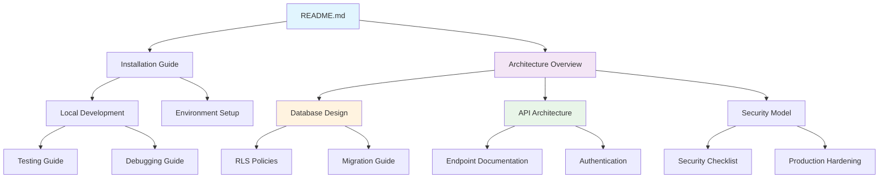

# ExoDrive Documentation Audit Report
## Agent 1: Documentation Auditor

**Date**: January 22, 2025  
**Agent**: Documentation Auditor  
**Status**: Comprehensive Documentation Analysis Complete

---

## Executive Summary

The ExoDrive project demonstrates a well-documented, production-ready car rental platform with comprehensive documentation coverage across multiple domains. However, several areas require modernization and enhancement to align with current framework versions and industry best practices.

### Current Documentation State
- **Documentation Files**: 15+ core documentation files
- **Total Documentation**: ~3,500+ lines across README, API docs, database docs, and specialized guides
- **Coverage Level**: Good (75-85%) - covers most critical areas
- **Organization**: Well-structured with clear separation of concerns
- **Maintenance Status**: Mixed - some sections current, others showing signs of age

### Key Findings Summary
- ✅ Excellent API documentation with detailed endpoint specifications
- ✅ Comprehensive database architecture documentation
- ✅ Strong security documentation including RLS policies
- ⚠️ Framework version gaps (Next.js 15 vs documented patterns)
- ⚠️ Some Redis/caching documentation lacks current best practices
- ❌ Missing documentation for newer features (payment capture automation)
- ❌ Outdated deployment and environment setup instructions

---

## Current Documentation Analysis

### 1. Core Documentation Files

#### README.md (981 lines) - **Grade: A-**
**Strengths:**
- Comprehensive project overview with clear feature descriptions
- Well-structured table of contents
- Detailed tech stack documentation
- Excellent command reference section
- Clear deployment checklist

**Gaps Identified:**
- Next.js 15 specific features not fully documented
- App Router migration patterns incomplete
- Missing React Server Components best practices
- Outdated Bun runtime setup instructions

#### API_DOCUMENTATION.md (712 lines) - **Grade: A**
**Strengths:**
- Complete endpoint documentation with request/response examples
- Excellent error handling documentation
- Rate limiting clearly explained
- Security features well documented

**Minor Issues:**
- Some TypeScript examples could be more robust
- Missing OpenAPI/Swagger specification

#### CONTRIBUTING.md (288 lines) - **Grade: B+**
**Strengths:**
- Clear development guidelines
- Good code style examples
- Testing requirements well defined

**Areas for Improvement:**
- Missing AI/LLM-specific contribution guidelines
- No documentation for working with agents
- Limited guidance on modern Next.js patterns

#### database.md (1200+ lines) - **Grade: A**
**Strengths:**
- Extremely comprehensive database documentation
- Excellent RLS policy examples
- Performance optimization strategies
- Clear migration guidelines

**No major issues identified**

### 2. Specialized Documentation

#### Cache Warming Documentation (/docs/cache-warming.md) - **Grade: B+**
**Strengths:**
- Good coverage of Redis caching strategies
- Clear CLI examples
- Bun-specific optimizations documented

**Enhancement Needed:**
- Missing latest Upstash Redis patterns
- Limited distributed caching strategies
- No documentation for cache invalidation patterns

#### PayPal Integration (/docs/integrations/paypal.md) - **Grade: A-**
**Strengths:**
- Comprehensive payment flow documentation
- Good schema documentation
- Environment configuration clear

**Minor Issues:**
- Could include more error handling scenarios
- Missing webhook retry documentation

### 3. Missing Documentation Areas

#### High Priority Missing Documentation:
1. **Next.js 15 App Router Migration Guide**
2. **React Server Components Implementation Patterns**
3. **Modern TypeScript Patterns Guide**
4. **Supabase Edge Functions Best Practices**
5. **Production Monitoring and Alerting Setup**
6. **Automated Testing Strategy for AI Agents**

#### Medium Priority Missing Documentation:
1. **Container/Docker deployment guide**
2. **CI/CD pipeline documentation**
3. **Backup and disaster recovery procedures**
4. **Performance monitoring setup**
5. **Third-party integrations roadmap**

---

## Framework Version Analysis

### Next.js 15 vs Current Implementation

#### Current Status vs Latest Documentation:

**Next.js App Router (Current Implementation)**
```typescript
// Current pattern in codebase
export default async function Page() {
  const data = await getData()
  return <main>{data.message}</main>
}
```

**Next.js 15 Best Practices (From Context7)**
```typescript
// Recommended pattern with better error handling
async function getData() {
  const res = await fetch('https://api.example.com/...', {
    cache: 'no-store' // or 'force-cache', 'reload', 'default'
  });
  if (!res.ok) {
    throw new Error('Failed to fetch data')
  }
  return res.json()
}

export default async function Page() {
  const data = await getData()
  return <main>{data.message}</main>
}
```

**Gaps Identified:**
- Missing fetch caching strategies documentation
- Limited error boundary patterns
- No streaming and Suspense examples
- Incomplete server action documentation

### Supabase Implementation vs Latest Patterns

#### Current RLS Implementation:
```sql
create policy "Users can view their own todos."
  on public.todos
  for select
  using ( ( select auth.uid() ) = user_id );
```

**This aligns well with current Supabase best practices** ✅

#### Areas for Enhancement:
- Missing performance optimization patterns for RLS
- No documentation for Supabase Edge Functions integration
- Limited real-time subscription examples

### Redis/Upstash Implementation Analysis

#### Current Implementation:
```typescript
const redis = new Redis({
  url: process.env.UPSTASH_REDIS_REST_URL,
  token: process.env.UPSTASH_REDIS_REST_TOKEN,
});
```

**This aligns with current Upstash patterns** ✅

#### Enhancement Opportunities:
- Missing distributed locking patterns
- No semantic caching examples
- Limited rate limiting documentation

---

## Documentation Gap Analysis

### Critical Gaps (High Impact)

#### 1. Modern Development Patterns
- **Missing**: Next.js 15 specific patterns
- **Impact**: Developers may use outdated patterns
- **Recommendation**: Create Next.js 15 migration guide

#### 2. Production Readiness
- **Missing**: Comprehensive monitoring setup
- **Impact**: Difficult to troubleshoot production issues
- **Recommendation**: Add observability documentation

#### 3. AI/Agent Integration
- **Missing**: Documentation for AI agent workflows
- **Impact**: Poor agent collaboration
- **Recommendation**: Create agent-specific documentation

### Moderate Gaps (Medium Impact)

#### 1. Testing Strategy
- **Current**: Basic test examples
- **Missing**: E2E testing for payment flows
- **Recommendation**: Expand testing documentation

#### 2. Security Hardening
- **Current**: Good RLS documentation
- **Missing**: Advanced security patterns
- **Recommendation**: Add security audit checklist

### Minor Gaps (Low Impact)

#### 1. Code Style Consistency
- **Current**: Good examples in CONTRIBUTING.md
- **Missing**: Automated linting rules documentation
- **Recommendation**: Document ESLint/Prettier setup

---

## Framework Modernization Recommendations

### 1. Next.js 15 Upgrade Documentation Needed

```markdown
# Next.js 15 Migration Guide (NEEDED)

## Server Components Optimization
- Fetch API caching strategies
- Error boundary patterns
- Streaming and Suspense implementation

## App Router Best Practices
- Route handlers optimization
- Middleware patterns
- Static/dynamic rendering decisions

## Performance Optimizations
- React Compiler integration
- Bundle optimization
- Core Web Vitals monitoring
```

### 2. Supabase Edge Functions Documentation

```markdown
# Supabase Edge Functions Guide (NEEDED)

## Function Development
- TypeScript setup and best practices
- Local development workflow
- Testing strategies

## Production Deployment
- Environment management
- Monitoring and logging
- Error handling patterns
```

### 3. Advanced Redis Patterns Documentation

```markdown
# Advanced Redis Patterns (ENHANCEMENT NEEDED)

## Distributed Systems
- Distributed locking
- Cache invalidation strategies
- Multi-region caching

## Performance Optimization
- Pipeline optimization
- Memory management
- Connection pooling
```

---

## Documentation Structure Improvements

### Current Structure
```
/
├── README.md (981 lines)
├── API_DOCUMENTATION.md (712 lines)
├── CONTRIBUTING.md (288 lines)
├── database.md (1200+ lines)
├── /docs/
│   ├── cache-warming.md
│   ├── webhook-monitoring.md
│   └── /integrations/
│       └── paypal.md
```

### Recommended Enhanced Structure
```
/docs/
├── README.md (Project overview)
├── /getting-started/
│   ├── installation.md
│   ├── local-development.md
│   └── first-deployment.md
├── /architecture/
│   ├── system-overview.md
│   ├── database-design.md
│   ├── api-design.md
│   └── security-model.md
├── /guides/
│   ├── next-js-15-patterns.md
│   ├── supabase-edge-functions.md
│   ├── redis-optimization.md
│   └── payment-integration.md
├── /api/
│   ├── endpoints.md
│   ├── authentication.md
│   ├── rate-limiting.md
│   └── webhooks.md
├── /deployment/
│   ├── production-setup.md
│   ├── monitoring.md
│   ├── backup-recovery.md
│   └── scaling.md
├── /contributing/
│   ├── development-workflow.md
│   ├── testing-guidelines.md
│   ├── code-style.md
│   └── agent-collaboration.md
└── /troubleshooting/
    ├── common-issues.md
    ├── debugging-guide.md
    └── performance-tuning.md
```

---

## Priority Documentation Tasks

### Phase 1: Critical Updates (Week 1-2)
1. **Create Next.js 15 Migration Guide**
   - Server Components best practices
   - App Router optimization patterns
   - Caching strategies

2. **Update Installation Documentation**
   - Current Node.js/Bun setup
   - Environment configuration
   - Development workflow

3. **Production Monitoring Guide**
   - Error tracking setup
   - Performance monitoring
   - Alert configuration

### Phase 2: Framework Modernization (Week 3-4)
1. **Supabase Edge Functions Guide**
   - Development patterns
   - Deployment strategies
   - Testing approaches

2. **Advanced Redis Documentation**
   - Distributed patterns
   - Performance optimization
   - Monitoring and alerting

3. **Security Hardening Guide**
   - Advanced RLS patterns
   - API security checklist
   - Vulnerability assessment

### Phase 3: Enhanced Developer Experience (Week 5-6)
1. **Interactive API Documentation**
   - OpenAPI specification
   - Request/response examples
   - SDK generation

2. **Testing Strategy Guide**
   - E2E testing setup
   - Performance testing
   - Security testing

3. **Agent Collaboration Guide**
   - AI agent workflows
   - Code generation patterns
   - Review processes

---

## Integration Points Between Documentation

### Documentation Dependency Graph


---

## Documentation Tools and Automation Recommendations

### 1. Documentation Generation
```bash
# Recommended tools for automation
npm install -D typedoc @apidevtools/swagger-parser
npm install -D @docusaurus/core @docusaurus/preset-classic
```

### 2. API Documentation
```yaml
# Recommended OpenAPI setup
openapi: 3.0.0
info:
  title: ExoDrive API
  version: 2.5.0
  description: Exotic car rental platform API
```

### 3. Documentation Validation
```bash
# Add to CI/CD pipeline
npm run docs:lint
npm run docs:test-links
npm run docs:generate
```

---

## Handoff Notes for Next Agents

### For Agent 2 (Architecture Reviewer):
- Database documentation is comprehensive but may need performance optimization updates
- RLS policies are well-documented and current
- Missing edge function integration patterns

### For Agent 3 (Security Auditor):
- Security documentation exists but needs expansion
- RLS examples are good but missing advanced patterns
- Payment security well documented

### For Agent 4 (Performance Optimizer):
- Cache warming documentation exists but needs Redis best practices update
- Missing distributed caching patterns
- Database optimization strategies documented

### For Agent 5 (Integration Specialist):
- PayPal integration well documented
- Missing webhook retry patterns
- Need Supabase Edge Functions integration guide

### For Agent 6 (Testing Engineer):
- Basic testing guidelines exist
- Missing E2E testing for payment flows
- Need performance testing documentation

---

## Conclusion

The ExoDrive project has a solid documentation foundation with excellent coverage of core functionality, API endpoints, and database design. However, to maintain relevance and support modern development practices, significant updates are needed in the areas of framework modernization (Next.js 15), enhanced deployment patterns, and developer experience improvements.

The recommended documentation restructuring and priority task list will provide a roadmap for bringing the documentation up to current industry standards while maintaining the project's already strong foundation.

**Overall Documentation Grade: B+ (Good foundation, needs modernization)**

**Recommended Next Steps:**
1. Implement Phase 1 critical updates immediately
2. Begin framework modernization documentation
3. Establish documentation maintenance workflow
4. Set up automated documentation validation

This audit provides the foundation for the remaining agents to build upon, ensuring consistent and comprehensive coverage across all project aspects.