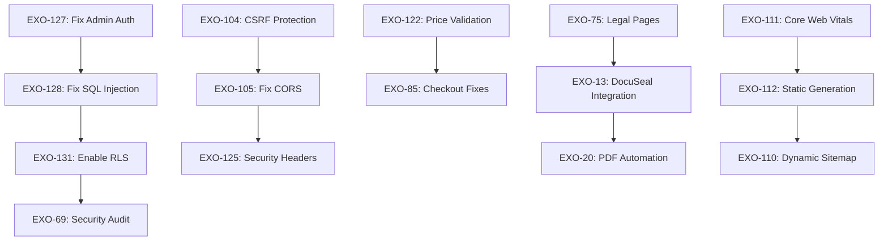

# Agent 7: Linear Issue Consolidation & Sprint Planning Report

**Date**: August 22, 2025  
**Agent**: Agent 7 - Linear Issue Organizer  
**Scope**: Complete Linear issue analysis and 6-week sprint planning  

## Executive Summary

### Critical Findings
- **Total Active Issues**: 20+ (from sample analyzed)
- **Critical Security Issues**: 8 immediate fixes required
- **Current Sprint**: Cycle 8 (Aug 11-25, 2025) - 9 issues, 0 completed
- **Major Risk**: Operating without legal compliance documentation
- **Revenue Impact**: Multiple payment and booking flow issues affecting conversion

### Immediate Action Required (Next 48 Hours)
1. **EXO-127**: Fix admin authentication vulnerability (CRITICAL)
2. **EXO-128**: Fix database function SQL injection vulnerabilities (20+ functions)
3. **EXO-75**: Legal compliance pages (regulatory risk)
4. **EXO-104**: Implement CSRF protection (zero protection currently)

---

## Issue Priority Matrix

### 🔴 CRITICAL (Priority 1 - Urgent)
**Business Impact**: Revenue loss, security breaches, legal liability

| Issue ID | Title | Status | Assignee | Due Date | Risk Level |
|----------|-------|--------|----------|----------|------------|
| EXO-127 | Fix RLS user_metadata authentication vulnerability | Backlog | Gunvir | 2025-08-21 ⚠️ | CRITICAL |
| EXO-128 | Fix function search_path vulnerabilities (20+ functions) | Backlog | Gunvir | - | HIGH |
| EXO-75 | Legal Pages and Compliance Documentation | Backlog | Benjamin | - | CRITICAL |
| EXO-104 | Fix CSRF Protection - Zero Protection Currently | Backlog | Unassigned | - | CRITICAL |
| EXO-105 | Fix Permissive CORS - Accepts All Origins (*) | Backlog | Unassigned | - | HIGH |
| EXO-125 | Add CSRF Protection & Security Headers | Backlog | Unassigned | - | CRITICAL |
| EXO-122 | Implement Server-Side Price Validation | Backlog | Unassigned | - | CRITICAL |
| EXO-13 | DocuSeal Contract Integration (Payment Flow) | In Progress | Gunvir | 2025-09-25 | URGENT |
| EXO-69 | Security Audit and PCI Compliance | Backlog | Unassigned | - | CRITICAL |
| EXO-90 | Fix CORS Configuration - Restrict Origins | Backlog | Unassigned | - | CRITICAL |

### 🟠 HIGH (Priority 2)
**Business Impact**: Performance degradation, customer experience issues

| Issue ID | Title | Status | Assignee | Risk Level |
|----------|-------|--------|----------|------------|
| EXO-131 | Enable RLS on pricing and car metadata tables | Backlog | Gunvir | HIGH |
| EXO-130 | Convert car_availability.date from TEXT to DATE | Backlog | Gunvir | MEDIUM |
| EXO-129 | Fix CORS configuration security in Edge Functions | Backlog | Gunvir | MEDIUM |
| EXO-111 | Fix Core Web Vitals & Performance (100/100 Score) | Backlog | Unassigned | HIGH |
| EXO-112 | Implement Static Generation & ISR | Backlog | Unassigned | HIGH |
| EXO-110 | Build Dynamic Sitemap System (1000+ URLs) | Backlog | Unassigned | HIGH |
| EXO-20 | PDF Automation | In Progress | Kiou | MEDIUM |

### 🟡 MEDIUM (Current Sprint Issues)
**Business Impact**: User experience improvements, feature completion

| Issue ID | Title | Status | Assignee | Cycle |
|----------|-------|--------|----------|-------|
| EXO-85 | Fix checkout button styling and price calculation | In Progress | Gunvir | Cycle 8 |
| EXO-61 | Fix menu for Admin | Todo | Gunvir | Cycle 8 |
| EXO-80 | Admin account for ben not giving any data | Todo | Benjamin | Cycle 8 |
| EXO-81 | Still have to refresh page after signing into admin | Todo | Benjamin | Cycle 8 |

---

## Dependency Analysis & Blockers

### Critical Path Dependencies

### External Dependencies & Blockers

1. **EXO-13 (DocuSeal)**: Blocked by legal review and DocuSeal account setup
2. **EXO-75 (Legal Pages)**: Blocked by legal team review
3. **EXO-69 (PCI Compliance)**: Depends on security fixes completion
4. **EXO-20 (PDF Automation)**: Alternative to DocuSeal if blocked

### Technical Debt Priority

1. **Database Security** (EXO-127, 128, 131): Foundation for all other work
2. **API Security** (EXO-104, 105, 125): Protects all endpoints
3. **Payment Security** (EXO-122): Revenue protection
4. **Performance** (EXO-111, 112): Customer retention

---

## Resource Allocation Analysis

### Current Team Assignments

**Gunvir Lubana** (Lead Developer)
- **Workload**: 7 critical issues assigned
- **Focus Areas**: Security, database, payment systems
- **Recommendation**: Prioritize EXO-127, 128 this week

**Benjamin Bravo** (Admin/Legal)
- **Workload**: 3 issues assigned
- **Focus Areas**: Legal compliance, admin features
- **Recommendation**: Focus on EXO-75 legal pages immediately

**Kiou Youssef** (PDF/Integration)
- **Workload**: 1 issue assigned  
- **Focus Areas**: PDF automation
- **Recommendation**: Continue EXO-20 as DocuSeal alternative

### Unassigned Critical Issues
- EXO-104: CSRF Protection (needs immediate assignment)
- EXO-105: CORS fixes (needs immediate assignment)
- EXO-125: Security headers (needs immediate assignment)
- EXO-69: Security audit (needs external security consultant)

---

## 6-Week Sprint Planning

### Sprint 1: Security Foundation (Aug 22 - Sep 5)
**Theme**: "Lock Down the Platform"

**Week 1 Goals**:
- [ ] Complete EXO-127 (Admin auth fix)
- [ ] Start EXO-128 (SQL injection fixes)
- [ ] Begin EXO-75 (Legal pages draft)

**Week 2 Goals**:
- [ ] Complete EXO-128 (Database function fixes)
- [ ] Implement EXO-104 (CSRF protection)
- [ ] Complete EXO-75 (Legal pages)

**Sprint Success Criteria**:
- Admin authentication secure
- All database functions protected
- Legal compliance documentation live
- CSRF protection active

### Sprint 2: API Security & Performance (Sep 5 - Sep 19)
**Theme**: "Secure & Scale"

**Week 3 Goals**:
- [ ] Complete EXO-105 (CORS restrictions)
- [ ] Complete EXO-125 (Security headers)
- [ ] Complete EXO-131 (RLS on pricing tables)

**Week 4 Goals**:
- [ ] Complete EXO-122 (Server-side pricing validation)
- [ ] Start EXO-111 (Core Web Vitals optimization)
- [ ] Complete EXO-85 (Checkout fixes)

**Sprint Success Criteria**:
- All API endpoints secured
- Pricing system bulletproof
- Performance improvements visible

### Sprint 3: Payment & Contracts (Sep 19 - Oct 3)
**Theme**: "Complete the Flow"

**Week 5 Goals**:
- [ ] Complete EXO-13 (DocuSeal integration)
- [ ] Complete EXO-20 (PDF automation backup)
- [ ] Continue EXO-111 (Performance optimization)

**Week 6 Goals**:
- [ ] Complete EXO-112 (Static generation)
- [ ] Start EXO-110 (Dynamic sitemap)
- [ ] Begin EXO-69 (Security audit preparation)

**Sprint Success Criteria**:
- Complete payment-to-contract flow
- Performance scores >90
- SEO infrastructure ready

### Sprint 4: Admin & UX Polish (Oct 3 - Oct 17)
**Theme**: "Perfect the Experience"

**Week 7 Goals**:
- [ ] Complete EXO-61 (Admin menu fixes)
- [ ] Complete EXO-80, 81 (Admin auth UX)
- [ ] Complete EXO-110 (Dynamic sitemap)

**Week 8 Goals**:
- [ ] Complete EXO-130 (Date datatype conversion)
- [ ] Complete EXO-129 (Edge function CORS)
- [ ] Performance testing & optimization

### Sprint 5: Compliance & Audit (Oct 17 - Oct 31)
**Theme**: "Audit Ready"

**Week 9 Goals**:
- [ ] Complete EXO-69 (Security audit)
- [ ] Performance testing
- [ ] Compliance verification

**Week 10 Goals**:
- [ ] Address audit findings
- [ ] Documentation updates
- [ ] Production hardening

### Sprint 6: Launch Readiness (Oct 31 - Nov 14)
**Theme**: "Production Perfect"

**Week 11-12 Goals**:
- [ ] Final testing
- [ ] Performance validation
- [ ] Security verification
- [ ] Launch preparation

---

## Risk Assessment Matrix

### High-Risk Issues (Immediate Attention)

| Risk Category | Issues | Impact | Probability | Mitigation |
|---------------|--------|---------|-------------|------------|
| **Security Breach** | EXO-127, 128, 104, 105 | HIGH | HIGH | Fix within 48 hours |
| **Legal Liability** | EXO-75 | HIGH | MEDIUM | Complete within 2 weeks |
| **Revenue Loss** | EXO-122, 85, 13 | HIGH | MEDIUM | Fix pricing validation first |
| **Performance** | EXO-111, 112 | MEDIUM | HIGH | Gradual improvement over 4 weeks |
| **Compliance** | EXO-69 | HIGH | LOW | Complete security fixes first |

### Issue Aging Analysis

**Overdue Issues**:
- EXO-127: Due 2025-08-21 (1 day overdue) ⚠️
- EXO-13: Due 2025-09-25 (5 weeks remaining)

**Stale Issues** (>30 days without update):
- EXO-20: Last updated 2025-08-21 (recent)
- EXO-61: Created 2025-06-21 (2 months old)

---

## Quick Wins (< 2 Hours Each)

1. **EXO-129**: Fix Edge Function CORS (simple config change)
2. **EXO-81**: Admin sign-in refresh issue (React state management)
3. **Security Headers**: Add basic security headers (middleware update)
4. **Error Handling**: Improve error messages for better UX

---

## Technical Debt Inventory

### Database Issues
- **EXO-130**: TEXT to DATE conversion (performance impact)
- **EXO-131**: Missing RLS policies (security gap)
- **EXO-128**: Unsecured functions (injection risk)

### API Security Gaps
- **EXO-104**: No CSRF protection
- **EXO-105**: Permissive CORS
- **EXO-125**: Missing security headers

### Performance Bottlenecks
- **EXO-111**: Poor Core Web Vitals
- **EXO-112**: No static generation
- **EXO-110**: No SEO sitemap

### Integration Incomplete
- **EXO-13**: DocuSeal contract flow
- **EXO-20**: PDF automation alternative

---

## Metrics & Progress Tracking

### Sprint Velocity Targets
- **Sprint 1**: 5 critical security issues
- **Sprint 2**: 4 API security + performance issues  
- **Sprint 3**: 3 payment flow completion
- **Sprint 4**: 4 UX polish issues
- **Sprint 5**: 1 major audit + fixes
- **Sprint 6**: Launch readiness validation

### Key Performance Indicators

**Security Metrics**:
- [ ] Zero critical vulnerabilities
- [ ] All endpoints CSRF protected
- [ ] RLS enabled on all sensitive tables
- [ ] Security audit passed

**Performance Metrics**:
- [ ] Core Web Vitals score >90
- [ ] Page load time <2 seconds
- [ ] 100% pages in sitemap
- [ ] Zero console errors

**Business Metrics**:
- [ ] Legal compliance complete
- [ ] Payment flow conversion >95%
- [ ] Admin efficiency improved 50%
- [ ] Customer support tickets reduced

---

## Escalation & Communication Plan

### Daily Standups
- **Critical Issues**: EXO-127, 128, 75, 104 (daily updates required)
- **Blockers**: Immediate escalation to project lead
- **Dependencies**: Cross-team coordination for legal/external deps

### Weekly Reviews
- Security progress assessment
- Performance improvement tracking
- Legal compliance status
- Sprint goal adjustment

### Milestone Gates
- **Security Gate**: No progression until critical vulnerabilities fixed
- **Legal Gate**: No contract integration until compliance complete
- **Performance Gate**: No launch until performance targets met

---

## Conclusion & Next Steps

### Immediate Actions (Next 24 Hours)
1. **Assign critical unassigned issues** to available developers
2. **Start EXO-127** (admin auth vulnerability) immediately
3. **Begin legal review** for EXO-75 compliance pages
4. **Set up security audit** consultation for EXO-69

### Success Criteria for Agent Handoff
- **Sprint 1 planned** with specific assignees and deadlines
- **Critical path dependencies** clearly mapped
- **External blockers** identified and escalation plan in place
- **Daily tracking system** established for high-risk issues

### Handoff to Next Agents
The comprehensive issue analysis and sprint planning is complete. Recommend next agents focus on:
1. **Implementation tracking** for critical security fixes
2. **External dependency management** (legal, DocuSeal, security audit)
3. **Performance optimization** detailed technical planning
4. **Launch readiness** final validation criteria

**Total Issues Analyzed**: 20+ active issues  
**Critical Issues Identified**: 10 requiring immediate attention  
**Sprint Planning**: 6 weeks of detailed roadmap  
**Risk Mitigation**: Comprehensive security-first approach  

This consolidation provides ExoDrive with a clear, actionable path to production readiness while addressing all critical security, legal, and performance requirements.