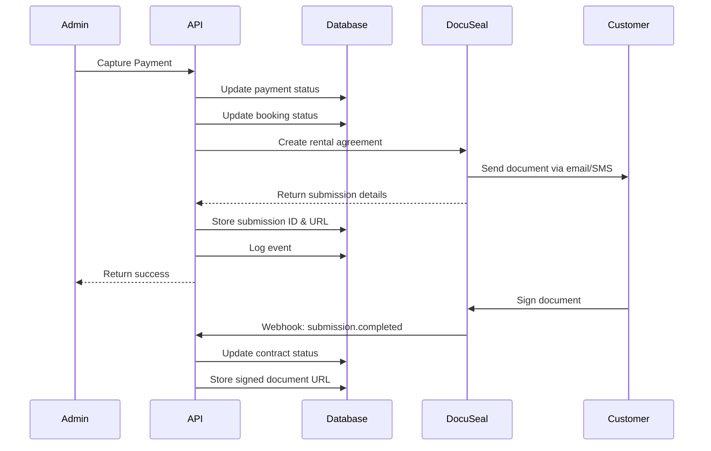

# DocuSeal Integration Documentation

## Overview

The ExoDrive platform integrates with DocuSeal to automatically generate and send rental agreement documents when a payment is successfully captured. This ensures customers receive their rental contracts immediately after completing payment, with all relevant information pre-filled.

## Features

- **Automatic Document Creation**: Rental agreements are automatically created when payment is captured
- **Pre-filled Data**: Customer information, vehicle details, and rental dates are automatically populated
- **Email/SMS Delivery**: Documents are sent via email and optionally SMS
- **Webhook Integration**: Real-time updates when documents are viewed or signed
- **Error Handling**: Graceful fallback if document creation fails (doesn't block payment)

## Setup

### 1. DocuSeal Account Setup

1. Create a DocuSeal account at [https://docuseal.com](https://docuseal.com)
2. Create a rental agreement template with the following fields:
   - Customer Information:
     - `customer_full_name`
     - `customer_first_name`
     - `customer_last_name`
     - `customer_email`
     - `customer_phone`
   - Vehicle Information:
     - `vehicle_make`
     - `vehicle_model`
     - `vehicle_year`
     - `vehicle_name`
     - `vehicle_description`
   - Rental Details:
     - `pickup_date`
     - `dropoff_date`
     - `rental_days`
     - `rental_amount`
     - `security_deposit`
     - `currency`
   - Booking Reference:
     - `booking_id`
     - `booking_reference`
     - `booking_date`

3. Note your template ID from the DocuSeal dashboard

### 2. Environment Configuration

Copy `.env.docuseal.example` to `.env.local` and configure:

```bash
# Required
DOCUSEAL_API_KEY=your_api_key_here
DOCUSEAL_RENTAL_TEMPLATE_ID=your_template_id_here

# Optional (defaults shown)
DOCUSEAL_API_URL=https://api.docuseal.com
DOCUSEAL_WEBHOOK_SECRET=your_webhook_secret_here
DOCUSEAL_DEBUG=false
```

### 3. Data Setup (No Database Changes Required)

The integration uses your existing database structure. To ensure proper document population, make sure your cars have the appropriate specifications:

**Option 1: Add specifications to `car_specifications` table**
```sql
-- Example: Add make, model, year for a car
INSERT INTO car_specifications (car_id, name, value) VALUES 
  ('your-car-id', 'Make', 'Toyota'),
  ('your-car-id', 'Model', 'Camry'),
  ('your-car-id', 'Year', '2024');
```

**Option 2: Use descriptive car names**
The system can intelligently parse car names like:
- "2024 Toyota Camry" 
- "BMW X5 2023"
- "Mercedes-Benz GLE"

No database migration is needed - the service works with your existing structure

### 4. Configure Webhook Endpoint

In your DocuSeal dashboard:
1. Go to Settings > Webhooks
2. Add a new webhook with URL: `https://your-domain.com/api/webhooks/docuseal`
3. Copy the webhook secret and add it to your environment variables
4. Select events to listen for:
   - `submission.created`
   - `submission.viewed`
   - `submission.completed`

## How It Works

### Payment Capture Flow



### Data Flow

1. **Payment Capture**: When an admin captures a payment, the system triggers document creation
2. **Data Gathering**: The service fetches:
   - Booking details (dates, amounts)
   - Customer information (name, email, phone)
   - Car specifications (make, model, year)
3. **Document Creation**: A DocuSeal submission is created with all fields pre-filled
4. **Customer Notification**: DocuSeal sends the document to the customer
5. **Status Tracking**: The booking is updated with the submission ID and signing URL
6. **Webhook Updates**: When the customer signs, a webhook updates the booking status

## API Reference

### DocuSeal Service Methods

#### `createRentalAgreement(bookingId: string)`

Creates and sends a rental agreement for a specific booking.

```typescript
import { docuSealService } from '@/lib/services/docuseal-service';

try {
  const result = await docuSealService.createRentalAgreement(bookingId);
  console.log('Document created:', result.id);
} catch (error) {
  console.error('Failed to create document:', error);
}
```

#### `getSubmissionStatus(submissionId: string)`

Gets the current status of a document submission.

```typescript
const status = await docuSealService.getSubmissionStatus(submissionId);
console.log('Document status:', status.status);
```

#### `downloadDocument(submissionId: string)`

Downloads a signed document as a blob.

```typescript
const blob = await docuSealService.downloadDocument(submissionId);
// Save or process the blob
```

## Database Structure

### Existing Tables Used

The integration uses your existing database structure without modifications:

**`car_specifications` Table**
```sql
-- Existing structure (no changes needed)
CREATE TABLE car_specifications (
  id UUID PRIMARY KEY,
  car_id UUID REFERENCES cars(id),
  name TEXT,       -- e.g., 'Make', 'Model', 'Year'
  value TEXT,      -- e.g., 'Toyota', 'Camry', '2024'
  is_highlighted BOOLEAN
);
```

**`cars` Table**
```sql
-- Existing structure (no changes needed)
CREATE TABLE cars (
  id UUID PRIMARY KEY,
  name TEXT,       -- Can be parsed for make/model/year
  description TEXT,
  category TEXT,
  -- ... other existing fields
);
```

### Booking Contract Fields

```sql
-- Added by migration 20250116000000_add_docuseal_contract_fields.sql
ALTER TABLE bookings ADD COLUMN contract_document_id TEXT;
ALTER TABLE bookings ADD COLUMN contract_submission_id TEXT;
ALTER TABLE bookings ADD COLUMN contract_signing_url TEXT;
ALTER TABLE bookings ADD COLUMN contract_signed_at TIMESTAMPTZ;
ALTER TABLE bookings ADD COLUMN contract_template_version INTEGER DEFAULT 1;
```

## Testing

### Running Tests

```bash
# Run integration tests
bun test tests/integration/docuseal-integration.test.ts

# Run all tests
bun test
```

### Manual Testing

1. Create a test booking in your development environment
2. Capture the payment for the booking
3. Check the booking events to verify document creation
4. Check your email for the DocuSeal document
5. Sign the document and verify the webhook updates the booking

## Troubleshooting

### Common Issues

#### Document Not Created
- Check that `DOCUSEAL_API_KEY` is set correctly
- Verify `DOCUSEAL_RENTAL_TEMPLATE_ID` exists in your account
- Check the booking events table for error messages

#### Missing Vehicle Information
- Add specifications to `car_specifications` table with names: "Make", "Model", "Year"
- Or ensure car names follow a parseable format (e.g., "2024 Toyota Camry")
- The service will intelligently extract information from either source

#### Webhook Not Received
- Verify webhook URL is publicly accessible
- Check `DOCUSEAL_WEBHOOK_SECRET` matches DocuSeal configuration
- Review webhook logs in DocuSeal dashboard

### Debug Mode

Enable debug logging by setting:

```bash
DOCUSEAL_DEBUG=true
```

This will log:
- API requests and responses
- Data extraction details
- Webhook payloads

## Error Handling

The integration is designed to be fault-tolerant:

1. **Payment First**: Payment capture always completes, even if document creation fails
2. **Event Logging**: All successes and failures are logged to `booking_events`
3. **Retry Logic**: Failed document creation can be manually retried
4. **Graceful Degradation**: System continues to function if DocuSeal is unavailable

## Security Considerations

1. **API Key Storage**: Store API keys in environment variables, never in code
2. **Webhook Verification**: Always verify webhook signatures
3. **Data Privacy**: Only send necessary customer data to DocuSeal
4. **Access Control**: Limit document access to authorized users
5. **SSL/TLS**: Always use HTTPS for API communications

## Monitoring

### Key Metrics to Track

- Document creation success rate
- Average time to signature
- Webhook delivery success
- API response times

### Database Queries

```sql
-- Check document creation success rate
SELECT 
  COUNT(*) FILTER (WHERE event_type = 'document_created') as created,
  COUNT(*) FILTER (WHERE event_type = 'document_creation_failed') as failed,
  ROUND(
    COUNT(*) FILTER (WHERE event_type = 'document_created')::numeric / 
    NULLIF(COUNT(*) FILTER (WHERE event_type IN ('document_created', 'document_creation_failed')), 0) * 100, 
    2
  ) as success_rate
FROM booking_events
WHERE created_at > NOW() - INTERVAL '7 days';

-- Check contract signing status
SELECT 
  contract_status,
  COUNT(*) as count
FROM bookings
WHERE created_at > NOW() - INTERVAL '30 days'
GROUP BY contract_status;
```

## Future Enhancements

- [ ] Support for multiple document templates (e.g., insurance waivers)
- [ ] Bulk document creation for multiple bookings
- [ ] Document versioning and audit trail
- [ ] In-app document signing iframe
- [ ] Automatic reminder emails for unsigned documents
- [ ] Multi-language document support

## Support

For issues or questions:
1. Check this documentation
2. Review the test files for examples
3. Check booking events for error details
4. Contact DocuSeal support for API issues
