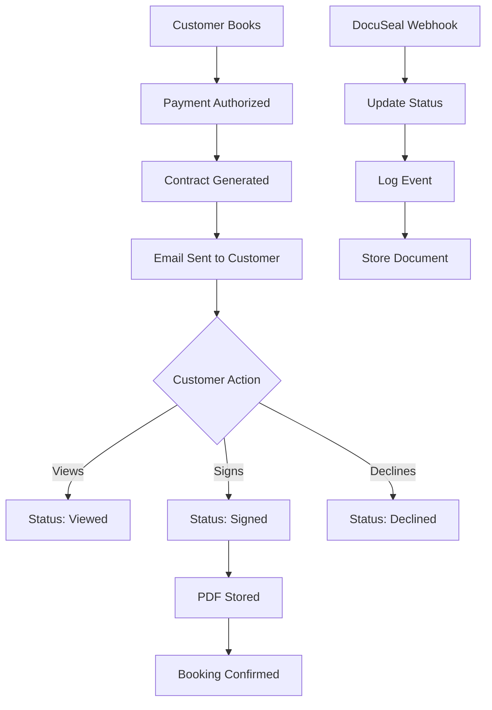

# DocuSeal Integration Documentation

## Overview

The ExoDrive platform integrates with DocuSeal for automated rental agreement generation and e-signature collection. This integration ensures that every booking has a legally binding contract that is automatically generated after payment authorization and tracked through completion.

## Architecture



## Configuration

### Environment Variables

```env
# DocuSeal API Configuration
DOCUSEAL_API_URL=https://api.docuseal.com
DOCUSEAL_API_TOKEN=your-api-token
DOCUSEAL_TEMPLATE_ID=1228139
DOCUSEAL_WEBHOOK_SECRET=ds_whsec_7K9mXpQ2vN5bR8tL3jF6wY4hA1sD0gE2
COMPANY_EMAIL=contracts@exodriveexotics.com
```

### Webhook Configuration

Configure the following webhook URL in your DocuSeal dashboard:

```
https://your-domain.com/api/webhooks/docuseal
```

Enable the following events:
- `submission.created`
- `submission.viewed`
- `submission.completed`
- `submission.expired`
- `submission.archived`

## Template Field Mapping

The rental agreement template (ID: 1228139) contains fields that are handled in two ways for security:

### System Pre-Filled Fields (Non-Sensitive)
| Template Field Name | Data Source | Example Value | Security Status |
|-------------------|-------------|---------------|----------------|
| `vehicle_make` | `cars.make` | "Ferrari" | ✅ Safe to transmit |
| `vehicle_model` | `cars.model` | "488 GTB" | ✅ Safe to transmit |
| `vehicle_year` | `cars.year` | "2023" | ✅ Safe to transmit |
| `color` | `cars.color` | "Red" | ✅ Safe to transmit |
| `estimated start date` | `bookings.start_date` | "January 1, 2025" | ✅ Safe to transmit |
| `estimated end date` | `bookings.end_date` | "January 5, 2025" | ✅ Safe to transmit |
| `Base Fee` | `bookings.total_price` | "$2,500.00" | ✅ Safe to transmit |
| `Miles` | `cars.daily_mileage_limit` | "100" | ✅ Safe to transmit |
| `Primary Vehicle Operator` | `customers.first_name + last_name` | "John Doe" | ✅ Safe to transmit |
| `Phone Number` | `customers.phone` | "+1234567890" | ✅ Safe to transmit |
| `Return Address` | `cars.pickup_location` | "123 Rental Lot, City, ST" | ✅ Safe to transmit |

### Customer-Filled Fields (PII Protected)
| Template Field Name | Filled By | Verification | Security Status |
|-------------------|-----------|--------------|----------------|
| `Driver's License` | Customer in DocuSeal | Admin review before rental | 🔒 **Never transmitted** |
| `Address` | Customer in DocuSeal | Admin review before rental | 🔒 **Never transmitted** |
| `Insurance Company` | Customer in DocuSeal | Admin review before rental | 🔒 **Never transmitted** |
| `Insurance policy` | Customer in DocuSeal | Admin review before rental | 🔒 **Never transmitted** |

### Additional Driver Fields (Optional)
The template supports up to 3 additional drivers with the following fields each:
- `Additional Vehicle Operator`
- `Additional Driver's License`
- `Additional Phone Number`
- `Additional Address`

### Signature Fields
- Primary Renter Signature (Required)
- Additional Driver Signature (Required if additional driver is present)
- Company Representative Signature (Auto-filled)

## API Integration

### Service Class: `DocuSealService`

Located at: `/lib/services/docuseal-service.ts`

#### Key Methods

##### 1. Generate Contract
```typescript
async generateContract(bookingId: string): Promise<{
  success: boolean;
  submissionId?: string;
  error?: string;
}>
```
- Fetches booking, customer, and car data
- Maps data to template fields
- Creates DocuSeal submission
- Sends contract via email
- Updates booking record

##### 2. Resend Contract
```typescript
async resendContract(bookingId: string): Promise<{
  success: boolean;
  error?: string;
}>
```
- Sends reminder email for existing contract
- Logs reminder event

##### 3. Get Submission Status
```typescript
async getSubmissionStatus(submissionId: string): Promise<{
  success: boolean;
  status?: string;
  data?: any;
  error?: string;
}>
```
- Fetches current status from DocuSeal
- Returns: `pending`, `sent`, `opened`, `completed`, or `declined`

##### 4. Download Signed Contract
```typescript
async downloadSignedContract(submissionId: string): Promise<{
  success: boolean;
  documents?: Array<{ url: string; filename: string }>;
  error?: string;
}>
```
- Retrieves signed PDF documents
- Returns download URLs

## Admin API Endpoints

### Generate Contract
```http
POST /api/admin/contracts
Content-Type: application/json

{
  "action": "generate",
  "bookingId": "uuid-here"
}

Response:
{
  "success": true,
  "submissionId": "12345",
  "message": "Contract generated and sent successfully"
}
```

### Resend Contract
```http
POST /api/admin/contracts
Content-Type: application/json

{
  "action": "resend",
  "bookingId": "uuid-here"
}

Response:
{
  "success": true,
  "message": "Contract reminder sent successfully"
}
```

### Get Contract Status
```http
GET /api/admin/contracts?bookingId=uuid-here

Response:
{
  "success": true,
  "status": "completed",
  "data": {
    "id": 12345,
    "submitters": [...],
    "completed_at": "2025-01-01T12:00:00Z"
  }
}
```

### Download Signed Contract
```http
GET /api/admin/contracts?submissionId=12345&action=download

Response:
{
  "success": true,
  "documents": [
    {
      "url": "https://docuseal.com/download/...",
      "filename": "rental-agreement.pdf"
    }
  ]
}
```

## Webhook Processing

### Webhook Handler: `/api/webhooks/docuseal/route.ts`

The webhook handler processes the following events:

#### Event: `submission.created`
- Updates `contract_status` to `sent`
- Stores submission ID
- Logs contract generation event

#### Event: `submission.viewed`
- Updates `contract_status` to `viewed`
- Logs view event with timestamp

#### Event: `submission.completed`
- Updates `contract_status` to `signed`
- Stores signed document URL
- Creates `booking_media` record for PDF
- Updates `overall_status` to `upcoming` if payment is authorized

#### Event: `submission.expired`
- Updates `contract_status` to `expired`
- Logs expiration event

#### Event: `submission.archived`
- Logs archive event
- No status update

### Webhook Security
- HMAC-SHA256 signature verification
- Idempotency checks
- Rate limiting
- Secure payload validation

## Automation Workflow

### Automatic Contract Generation

Contracts are automatically generated when:

1. **Payment Authorization** (Default Flow)
   - Triggered via PayPal webhook when payment is authorized
   - Contract sent immediately after successful payment
   - Customer receives email with signing link

2. **Manual Generation** (Admin Override)
   - Admin can manually generate contracts from dashboard
   - Used for special cases or regeneration

### Contract Lifecycle

```
1. Payment Authorized → Contract Generated
2. Email Sent → Status: "sent"
3. Customer Opens Email → Status: "viewed"
4. Customer Signs → Status: "signed"
5. PDF Stored → Booking Confirmed
```

### Status Tracking

Contract statuses in database:
- `not_sent`: Initial state
- `sent`: Email delivered
- `viewed`: Customer opened document
- `signed`: Agreement completed
- `declined`: Customer declined
- `expired`: Signing deadline passed

## Database Schema

### Booking Table Fields
```sql
-- Contract-related columns in bookings table
docuseal_submission_id TEXT,        -- DocuSeal submission ID
contract_status TEXT,                -- Current contract status
contract_sent_at TIMESTAMP,          -- When contract was sent
contract_document_url TEXT           -- Signed PDF URL
```

### Booking Media Storage
```sql
-- Signed contracts stored in booking_media
INSERT INTO booking_media (
  booking_id,
  media_type,
  file_url,
  file_name,
  metadata
) VALUES (
  'booking-uuid',
  'signed_contract',
  'https://docuseal.com/documents/...',
  'rental-agreement.pdf',
  '{"docuseal_submission_id": 12345}'
);
```

## Error Handling

### Common Errors and Solutions

#### 1. Template Not Found
```json
{
  "error": "DocuSeal API error: 404 - Template not found"
}
```
**Solution**: Verify `DOCUSEAL_TEMPLATE_ID` in environment variables

#### 2. Invalid API Token
```json
{
  "error": "DocuSeal API error: 401 - Unauthorized"
}
```
**Solution**: Check `DOCUSEAL_API_TOKEN` is valid

#### 3. Contract Already Exists
```json
{
  "error": "Contract already generated for this booking"
}
```
**Solution**: Use resend functionality instead of generate

#### 4. Customer Data Missing
```json
{
  "error": "Booking not found: Customer information incomplete"
}
```
**Solution**: Ensure customer profile is complete before generating contract

### Retry Strategy

Failed contract generations are logged but don't fail the payment webhook. Admins can:
1. View failed attempts in booking events
2. Manually regenerate contracts
3. Use bulk contract generation for multiple bookings

## Testing

### Test Environment Setup
1. Use DocuSeal sandbox account
2. Set test template ID in `.env.local`
3. Configure test webhook endpoint

### Test Scenarios
1. **Happy Path**: Payment → Contract → Sign → Complete
2. **Reminder Flow**: Generate → Wait → Resend → Sign
3. **Decline Flow**: Generate → Customer Declines → Handle
4. **Expiry Flow**: Generate → No Action → Expires → Regenerate

### Webhook Testing
```bash
# Test webhook signature verification
curl -X POST http://localhost:3005/api/webhooks/docuseal \
  -H "Content-Type: application/json" \
  -H "x-docuseal-signature: test-signature" \
  -d '{
    "event_type": "submission.completed",
    "data": {
      "id": 12345,
      "metadata": {"booking_id": "test-booking-id"}
    }
  }'
```

## Monitoring

### Key Metrics to Track
- Contract generation success rate
- Time to signature (generation → completion)
- Reminder effectiveness
- Decline/expiry rates
- API response times

### Dashboard Indicators
- Pending contracts count
- Overdue signatures
- Failed generation attempts
- Daily contract volume

## Best Practices

### 1. PII Security & Privacy
- **Never transmit PII to cloud services** - Customer fills sensitive data directly in DocuSeal
- **Admin verification required** - All PII fields reviewed manually before rental approval
- **Data minimization principle** - Only send necessary non-sensitive information
- **Secure field completion** - Customers enter PII directly in DocuSeal's secure interface

### 2. Data Validation
- Validate only non-sensitive customer data before generation
- Verify email addresses and phone numbers are valid
- Ensure all required non-PII fields are populated

### 2. Timing
- Generate contracts immediately after payment
- Send reminders after 24 hours if unsigned
- Set expiry to 7 days for urgency

### 3. Communication
- Include booking details in email subject
- Add urgency messaging for expiring contracts
- Provide clear signing instructions

### 4. Error Recovery
- Log all generation attempts
- Implement manual retry from admin panel
- Monitor webhook delivery health

### 5. Security
- Never expose API tokens in client code
- Verify all webhook signatures
- Use secure storage for signed documents
- Implement access controls for downloads

## Troubleshooting Guide

### Issue: Webhooks Not Received
1. Check webhook URL configuration in DocuSeal
2. Verify webhook secret matches
3. Check server logs for signature failures
4. Test with ngrok for local development

### Issue: Contracts Not Generating
1. Check API token validity
2. Verify template exists and is active
3. Review booking data completeness
4. Check error logs in booking_events

### Issue: Customers Not Receiving Emails
1. Verify customer email address
2. Check DocuSeal email delivery logs
3. Review spam folder instructions
4. Consider SMS delivery option

### Issue: Signed PDFs Not Storing
1. Check Supabase Storage configuration
2. Verify storage bucket permissions
3. Review webhook processing logs
4. Check booking_media insertion errors

## Support Resources

- DocuSeal API Documentation: https://docs.docuseal.com/api
- Template Builder Guide: https://docs.docuseal.com/templates
- Webhook Reference: https://docs.docuseal.com/webhooks
- ExoDrive Admin Guide: /docs/admin-guide.md
