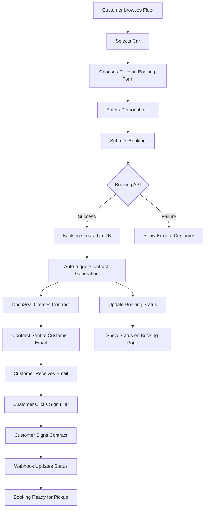

# DocuSeal Integration Plan – Exodrive

> **Status:** Ready for Implementation · Last updated December 13, 2024
> 
> This document outlines the complete integration plan for self-hosted DocuSeal to automate contract generation, signing, and management within the Exodrive car rental booking system.

---

## Key Focus: Automated Customer Booking Flow

**This integration prioritizes automatic contract generation when customers book through the Fleet → Car → Booking form flow.** 

When a customer completes a booking on your website:
1. They browse your fleet and select a car
2. Choose rental dates and enter their information
3. Upon successful booking, a contract is **automatically generated** without admin intervention
4. The customer receives the contract via email within 5-10 minutes
5. They sign electronically through DocuSeal
6. The signed contract is automatically stored and linked to their booking

This creates a seamless, professional experience where contracts are handled automatically from booking to signature, reducing admin workload and ensuring every booking has proper documentation.

---

## 1. Executive Summary

### 1.1 Objectives
- **Automate contract generation** from booking data (car details, customer info, rental dates)
- **Seamless e-signature workflow** integrated into admin dashboard and customer journey
- **Zero manual contract creation** – fully automated from booking to signed document
- **Customer-facing automation** – contracts automatically generated when customers book through fleet page
- **Dispute-ready evidence collection** with automatic PDF storage and linking
- **Real-time status tracking** via webhooks and timeline integration

### 1.2 Success Metrics
| Metric | Current State | Target |
|--------|---------------|--------|
| Contract generation time | Manual (30+ min) | Automated (< 30 sec) |
| Customer signing completion | N/A | > 85% within 24h |
| Admin contract management | Manual tracking | 100% automated dashboard |
| Dispute evidence preparation | Manual collection | Auto-linked documents |

---

## 2. Technical Architecture

### 2.1 System Integration Overview
```
┌─────────────────┐    ┌─────────────────┐    ┌─────────────────┐
│   Admin Clicks  │───▶│  Contract API   │───▶│  DocuSeal Self  │
│  "Send Contract"│    │   Generation    │    │     Hosted      │
└─────────────────┘    └─────────────────┘    └─────────────────┘
                              │                         │
                              ▼                         ▼
┌─────────────────┐    ┌─────────────────┐    ┌─────────────────┐
│  Update Status  │◀───│   Webhook       │◀───│   Customer      │
│   & Timeline    │    │   Handler       │    │   Signs Doc     │
└─────────────────┘    └─────────────────┘    └─────────────────┘
```

### 2.2 Technology Stack Integration
- **DocuSeal React Components**: `@docuseal/react` for embedded forms
- **JWT Token Generation**: Server-side secure token creation
- **Webhook Processing**: Real-time status updates via `/api/webhooks/docuseal`
- **PDF Storage**: Supabase Storage integration for signed documents
- **Timeline Integration**: Real-time updates in `booking_events` table

### 2.3 Self-Hosted DocuSeal Benefits
- **Data Sovereignty**: All contracts stay within Exodrive infrastructure
- **Custom Branding**: Fully branded signing experience
- **Direct Integration**: Server-to-server webhook reliability
- **Cost Control**: No per-document fees for high-volume usage
- **Evidence Integration**: Seamless linking to dispute management system

---

## 3. Database Schema Integration

### 3.1 New Fields Required
```sql
-- Add to existing bookings table
ALTER TABLE bookings ADD COLUMN IF NOT EXISTS contract_document_id TEXT;
ALTER TABLE bookings ADD COLUMN IF NOT EXISTS contract_template_id TEXT;
ALTER TABLE bookings ADD COLUMN IF NOT EXISTS contract_signing_url TEXT;
ALTER TABLE bookings ADD COLUMN IF NOT EXISTS contract_signed_at TIMESTAMPTZ;

-- Add to booking_events for timeline tracking
-- (Already exists, will use existing event_type enum)
```

### 3.2 Contract Status Flow
```
contract_status_enum Values:
├── not_sent       (initial state)
├── generating     (creating from template)
├── sent           (DocuSeal link sent to customer)
├── viewed         (customer opened signing page)
├── signed         (customer completed signature)
├── declined       (customer declined to sign)
└── expired        (signing deadline passed)
```

### 3.3 Evidence Linking
```sql
-- Automatic linking of signed contracts to booking_media
INSERT INTO booking_media (
  booking_id,
  stage,
  file_path,
  type,
  description,
  uploaded_by_type
) VALUES (
  booking_id,
  'contract',
  'contracts/signed_rental_agreement_[booking_id].pdf',
  'pdf',
  'Signed Rental Agreement',
  'system'
);
```

---

## 4. API Endpoints Design

### 4.1 Contract Management Endpoints
```typescript
// Generate and send contract
POST /api/admin/bookings/[id]/contract/generate
Body: {
  sendImmediately?: boolean;
  customMessage?: string;
}
Response: {
  success: boolean;
  contractId: string;
  signingUrl: string;
  expiresAt: string;
}

// Get contract status
GET /api/admin/bookings/[id]/contract/status
Response: {
  status: ContractStatus;
  documentId: string;
  signingUrl?: string;
  signedAt?: string;
  signedDocumentUrl?: string;
}

// Resend contract
POST /api/admin/bookings/[id]/contract/resend
Body: {
  customMessage?: string;
}

// Download signed contract
GET /api/admin/bookings/[id]/contract/download
Returns: PDF file stream
```

### 4.2 Webhook Handler
```typescript
// DocuSeal webhook endpoint
POST /api/webhooks/docuseal
Headers: {
  'X-DocuSeal-Signature': string; // Webhook verification
}
Body: {
  event_type: 'document.sent' | 'document.viewed' | 'document.signed' | 'document.declined';
  data: {
    document_id: string;
    booking_id: string; // Custom metadata
    signed_document_url?: string;
    signer_email: string;
    timestamp: string;
  }
}
```

### 4.3 Customer-Facing Endpoints
```typescript
// Get contract status for secure booking page
GET /api/bookings/[token]/contract
Response: {
  status: ContractStatus;
  signingUrl?: string;
  canSign: boolean;
  expiresAt?: string;
}
```

---

## 5. Admin Dashboard Integration

### 5.1 Booking Details Page Enhancements

#### Contract Status Section
```tsx
// New section in booking details
<ContractStatusSection>
  <StatusBadge status={contractStatus} />
  <ActionsPanel>
    {contractStatus === 'not_sent' && (
      <Button onClick={generateContract}>Send Contract</Button>
    )}
    {contractStatus === 'sent' && (
      <>
        <Button variant="outline" onClick={resendContract}>Resend</Button>
        <Button variant="ghost" onClick={viewSigningLink}>View Link</Button>
      </>
    )}
    {contractStatus === 'signed' && (
      <Button onClick={downloadContract}>Download Signed PDF</Button>
    )}
  </ActionsPanel>
</ContractStatusSection>
```

#### Timeline Integration
```tsx
// Enhanced booking timeline entries
const contractTimelineEvents = [
  {
    type: 'contract_generated',
    message: 'Rental agreement generated and sent to customer',
    timestamp: '2024-01-15 14:30:00',
    actor: 'admin',
    icon: FileText
  },
  {
    type: 'contract_viewed', 
    message: 'Customer viewed rental agreement',
    timestamp: '2024-01-15 16:45:00',
    actor: 'customer',
    icon: Eye
  },
  {
    type: 'contract_signed',
    message: 'Rental agreement signed by customer',
    timestamp: '2024-01-15 17:12:00', 
    actor: 'customer',
    icon: CheckCircle,
    attachment: 'signed_agreement.pdf'
  }
];
```

### 5.2 Bulk Contract Actions
```tsx
// Manage Bookings page enhancements
<BulkActionsPanel>
  <Button onClick={bulkSendContracts}>
    Send Contracts to Selected ({selectedCount})
  </Button>
  <Button onClick={bulkResendContracts}>
    Resend Contracts
  </Button>
</BulkActionsPanel>
```

### 5.3 Contract Analytics Dashboard
```tsx
// New admin analytics section
<ContractMetrics>
  <MetricCard title="Contracts Sent Today" value={contractsData.sentToday} />
  <MetricCard title="Pending Signatures" value={contractsData.pending} />
  <MetricCard title="Completion Rate" value={`${contractsData.completionRate}%`} />
  <MetricCard title="Avg. Signing Time" value={contractsData.avgSigningTime} />
</ContractMetrics>
```

---

## 6. Contract Template Design

### 6.1 Dynamic Template Structure
```
EXODRIVE LUXURY CAR RENTAL AGREEMENT
=====================================

CONTRACT ID: {{contract_id}}
BOOKING REFERENCE: {{booking_id}}

PARTIES:
--------
Renter: {{customer_first_name}} {{customer_last_name}}
Email: {{customer_email}}
Phone: {{customer_phone}}

Rental Company: Exodrive LLC
[Company Address & Details]

VEHICLE DETAILS:
---------------
Make & Model: {{car_name}}
Category: {{car_category}}
Specifications:
{{#car_specifications}}
- {{name}}: {{value}}
{{/car_specifications}}

RENTAL TERMS:
------------
Pickup Date: {{start_date}}
Return Date: {{end_date}}  
Total Days: {{rental_days}}

Pickup Location: {{pickup_address}}
Return Location: {{dropoff_address}}

PRICING:
--------
Daily Rate: ${{daily_rate}}
Total Rental Cost: ${{total_price}}
Security Deposit: ${{security_deposit_amount}}
Additional Fees:
{{#additional_fees}}
- {{name}}: ${{amount}}
{{/additional_fees}}

TERMS & CONDITIONS:
------------------
[Standard rental terms with signature fields]

SIGNATURES:
----------
Renter Signature: [DocuSeal Signature Field]
Date: [DocuSeal Date Field]

Company Representative: [Admin Signature]
Date: [Auto-filled]
```

### 6.2 Template Variables Mapping
```typescript
interface ContractTemplateData {
  // Booking Info
  contract_id: string;
  booking_id: string;
  start_date: string;
  end_date: string;
  rental_days: number;
  
  // Customer Info  
  customer_first_name: string;
  customer_last_name: string;
  customer_email: string;
  customer_phone: string;
  
  // Car Info
  car_name: string;
  car_category: string;
  car_specifications: Array<{name: string, value: string}>;
  
  // Pricing
  daily_rate: number;
  total_price: number;
  security_deposit_amount: number;
  additional_fees: Array<{name: string, amount: number}>;
  
  // Locations
  pickup_address: string;
  dropoff_address: string;
}
```

---

## 7. Automation Workflow

### 7.1 Contract Generation Triggers

#### Customer Booking Flow (Automatic)
When a customer completes booking through the fleet page:
```typescript
// In /api/bookings/route.ts after successful booking creation
if (bookingIdFromFunction) {
  // Automatically trigger contract generation
  await fetch(`${process.env.NEXT_PUBLIC_BASE_URL}/api/bookings/${bookingIdFromFunction}/contract/generate`, {
    method: 'POST',
    headers: { 
      'Content-Type': 'application/json',
      'X-Service-Token': process.env.INTERNAL_SERVICE_TOKEN // Internal auth
    },
    body: JSON.stringify({ 
      sendImmediately: true,
      isCustomerFlow: true,
      triggeredBy: 'customer_booking'
    })
  });
  
  // Update booking_events
  await createBookingEvent({
    booking_id: bookingIdFromFunction,
    event_type: 'contract_generation_queued',
    actor_type: 'system',
    summary_text: 'Contract generation automatically initiated after booking creation'
  });
}
```

#### Customer Booking Success Page Enhancement
```tsx
// In the booking success/confirmation page
export function BookingConfirmation({ bookingId, customerEmail }: Props) {
  return (
    <div className="booking-success">
      <CheckCircle className="h-16 w-16 text-green-600" />
      <h2>Booking Confirmed!</h2>
      <p>Your booking has been successfully created.</p>
      
      <div className="contract-status-card">
        <FileText className="h-8 w-8" />
        <div>
          <h3>Rental Agreement</h3>
          <p>Your rental agreement is being prepared and will be sent to {customerEmail} within the next few minutes.</p>
          <p className="text-sm text-muted">You'll receive an email with a secure link to sign the agreement online.</p>
        </div>
      </div>
      
      <Button onClick={() => router.push(`/booking/${secureToken}`)}>
        View Booking Details
      </Button>
    </div>
  );
}
```

#### Manual Trigger (Admin Dashboard)
```typescript
// Admin Dashboard: Booking Details Page
const handleSendContract = async () => {
  setLoading(true);
  try {
    const response = await fetch(`/api/admin/bookings/${bookingId}/contract/generate`, {
      method: 'POST',
      headers: { 'Content-Type': 'application/json' },
      body: JSON.stringify({ sendImmediately: true })
    });
    
    if (response.ok) {
      toast.success('Contract sent to customer!');
      refetchBookingData();
    }
  } catch (error) {
    toast.error('Failed to send contract');
  } finally {
    setLoading(false);
  }
};
```

### 7.1.1 Customer Flow Integration Points

**1. Fleet → Car Page → Booking Form Submission**
```typescript
// Enhanced booking API response includes contract status
POST /api/bookings
Response: {
  bookingId: string;
  bookingUrl: string;
  contractStatus: 'generating'; // Immediate feedback
  estimatedContractDelivery: '5-10 minutes';
}
```

**2. Secure Booking Page Enhancement**
```tsx
// /booking/[token]/page.tsx additions
<ContractStatusWidget>
  {contractStatus === 'generating' && (
    <Alert>
      <Loader2 className="animate-spin" />
      Your rental agreement is being prepared...
    </Alert>
  )}
  
  {contractStatus === 'sent' && !contractSignedAt && (
    <Alert>
      <Mail className="h-4 w-4" />
      Contract sent to your email. Please check your inbox to sign.
      <Button variant="link" onClick={resendContract}>
        Didn't receive it? Resend
      </Button>
    </Alert>
  )}
  
  {contractStatus === 'signed' && (
    <Alert variant="success">
      <CheckCircle className="h-4 w-4" />
      Contract signed on {format(contractSignedAt, 'PPP')}
      <Button variant="link" onClick={downloadContract}>
        Download PDF
      </Button>
    </Alert>
  )}
</ContractStatusWidget>
```

**3. Email Flow for Customers**
```typescript
// Automated email sequence
interface ContractEmailSequence {
  bookingConfirmation: {
    sent: 'immediately',
    includes: ['booking details', 'contract coming soon notice']
  },
  contractReady: {
    sent: 'when contract generated (5-10 min)',
    includes: ['signing link', 'instructions', 'deadline']
  },
  contractReminder: {
    sent: 'if not signed within 24h',
    includes: ['urgency message', 'support contact']
  },
  contractSigned: {
    sent: 'immediately after signing',
    includes: ['signed PDF attachment', 'next steps']
  }
}
```

### 7.2 Data Aggregation Process
```typescript
// Contract generation service
export class ContractGenerationService {
  async generateContractData(bookingId: string): Promise<ContractTemplateData> {
    // Single query to get all needed data
    const { data } = await supabase
      .from('bookings')
      .select(`
        *,
        customers (*),
        cars (*, car_specifications (*), car_pricing (*)),
        booking_locations (*),
        car_additional_fees (*)
      `)
      .eq('id', bookingId)
      .single();
    
    return this.mapToTemplateData(data);
  }
  
  private mapToTemplateData(booking: BookingWithRelations): ContractTemplateData {
    return {
      contract_id: `EXO-${booking.id.slice(0, 8).toUpperCase()}`,
      booking_id: booking.id,
      // ... map all fields
    };
  }
}
```

### 7.3 Webhook Processing Pipeline
```typescript
// Webhook handler with idempotency
export async function POST(request: Request) {
  const signature = request.headers.get('X-DocuSeal-Signature');
  const payload = await request.json();
  
  // Verify webhook signature
  if (!verifyDocuSealSignature(payload, signature)) {
    return new Response('Unauthorized', { status: 401 });
  }
  
  // Idempotency check
  const eventId = `${payload.data.document_id}-${payload.event_type}-${payload.timestamp}`;
  const existing = await checkProcessedEvent(eventId);
  if (existing) {
    return new Response('Already processed', { status: 200 });
  }
  
  // Process webhook
  await processDocuSealWebhook(payload);
  await markEventProcessed(eventId);
  
  return new Response('OK', { status: 200 });
}
```

---

## 8. Implementation Roadmap

### Phase 1: Foundation (Days 1-3)
- [ ] Install DocuSeal self-hosted instance
- [ ] Add `@docuseal/react` to dependencies
- [ ] Create contract template in DocuSeal admin
- [ ] Database schema updates for contract fields
- [ ] JWT token generation service

### Phase 2: Customer Booking Integration (Days 4-8) *[Priority]*
- [ ] Enhance `/api/bookings` to auto-trigger contract generation
- [ ] Create `/api/bookings/[id]/contract/generate` endpoint
- [ ] Implement contract generation service with booking data aggregation
- [ ] Add contract status to booking API responses
- [ ] Create booking confirmation page with contract status
- [ ] Implement `/api/webhooks/docuseal` webhook handler
- [ ] Set up automated email notifications for contract flow

### Phase 3: Customer Experience (Days 9-12)
- [ ] Enhance `/booking/[token]` page with contract status widget
- [ ] Add contract resend functionality for customers
- [ ] Implement contract download for signed documents
- [ ] Create mobile-responsive signing experience
- [ ] Set up contract reminder email automation
- [ ] Test complete customer flow end-to-end

### Phase 4: Admin Dashboard Integration (Days 13-17)
- [ ] Contract status section in booking details
- [ ] Manual send/resend contract buttons for admin
- [ ] Timeline integration for contract events
- [ ] Bulk contract actions for multiple bookings
- [ ] Contract analytics dashboard
- [ ] Admin notifications for unsigned contracts

### Phase 5: Advanced Features & Storage (Days 18-22)
- [ ] PDF storage integration (Supabase Storage)
- [ ] Dispute evidence auto-linking
- [ ] Contract template versioning
- [ ] Advanced error handling and retry logic
- [ ] Performance optimization for high volume
- [ ] Monitoring and alerting setup

### Phase 6: Testing & Launch (Days 23-27)
- [ ] Unit tests for contract services
- [ ] Integration tests for webhook flow
- [ ] End-to-end testing (Playwright) for customer journey
- [ ] Load testing for concurrent bookings
- [ ] Security audit and penetration testing
- [ ] Production deployment and monitoring

---

## 9. Testing Strategy

### 9.1 Unit Testing (Vitest)
```typescript
// Example test structure
describe('ContractGenerationService', () => {
  it('should generate contract data from booking', async () => {
    const service = new ContractGenerationService();
    const contractData = await service.generateContractData(mockBookingId);
    
    expect(contractData.contract_id).toMatch(/^EXO-[A-Z0-9]{8}$/);
    expect(contractData.customer_first_name).toBe('John');
    expect(contractData.total_price).toBe(2400);
  });
});

describe('DocuSeal Webhook Handler', () => {
  it('should process document.signed webhook', async () => {
    const mockPayload = createMockWebhook('document.signed');
    const response = await POST(createMockRequest(mockPayload));
    
    expect(response.status).toBe(200);
    expect(await getBookingContractStatus(mockBookingId)).toBe('signed');
  });
});
```

### 9.2 Integration Testing
```typescript
// Full contract flow test
describe('Contract Flow Integration', () => {
  it('should complete full contract workflow', async () => {
    // 1. Generate contract
    const contractResponse = await generateContract(testBookingId);
    expect(contractResponse.success).toBe(true);
    
    // 2. Simulate customer signing
    await simulateDocuSealSigning(contractResponse.contractId);
    
    // 3. Process webhook
    await processWebhook(createSignedWebhook(contractResponse.contractId));
    
    // 4. Verify status updates
    const booking = await getBooking(testBookingId);
    expect(booking.contract_status).toBe('signed');
    expect(booking.contract_signed_at).toBeTruthy();
  });
});
```

### 9.3 End-to-End Testing (Playwright)
```typescript
// Admin workflow test
test('Admin can send contract and track status', async ({ page }) => {
  await page.goto('/admin/bookings/test-booking-123');
  
  // Send contract
  await page.click('[data-testid="send-contract-btn"]');
  await expect(page.locator('[data-testid="contract-status"]')).toContainText('Sent');
  
  // Check timeline update
  await expect(page.locator('[data-testid="timeline"]')).toContainText('Contract sent to customer');
});
```

---

## 10. Security & Compliance

### 10.1 Data Protection
- **JWT Token Security**: Short-lived tokens (1 hour) with secure signing
- **Webhook Verification**: Cryptographic signature validation
- **PDF Storage**: Encrypted storage in Supabase with RLS policies
- **Audit Trail**: Complete logging of all contract operations

### 10.2 GDPR Compliance
```typescript
// Customer data deletion workflow
export async function deleteCustomerContractData(customerId: string) {
  // 1. Anonymize signed contracts (retain for legal compliance)
  await anonymizeContractData(customerId);
  
  // 2. Delete personal data from DocuSeal
  await docuSealClient.deleteCustomerData(customerId);
  
  // 3. Update audit logs
  await logGDPRDeletion(customerId, 'contract_data');
}
```

### 10.3 Legal Requirements
- **Digital Signature Validity**: DocuSeal provides legally binding e-signatures
- **Contract Retention**: 7-year retention policy for signed agreements
- **Dispute Evidence**: Automatic preservation of signing audit trail
- **Data Sovereignty**: Self-hosted ensures data remains in controlled jurisdiction

---

## 11. Monitoring & Analytics

### 11.1 Key Metrics Dashboard
```typescript
// Contract metrics to track
interface ContractMetrics {
  totalContractsSent: number;
  contractCompletionRate: number;
  averageSigningTime: string; // "2h 15m"
  pendingContracts: number;
  expiredContracts: number;
  contractsByStatus: Record<ContractStatus, number>;
  dailyContractVolume: Array<{date: string, count: number}>;
}
```

### 11.2 Alerting Rules
- **Webhook Failures**: Alert if webhook processing fails > 5 times
- **Signing Delays**: Alert if contracts pending > 48 hours
- **System Issues**: Alert if DocuSeal instance becomes unreachable
- **Completion Rates**: Alert if daily completion rate < 70%

### 11.3 Performance Monitoring
```typescript
// Key performance indicators
const contractKPIs = {
  contractGenerationTime: '< 30 seconds',
  webhookProcessingTime: '< 5 seconds',
  adminDashboardLoadTime: '< 2 seconds',
  customerSigningPageLoad: '< 3 seconds',
  uptime: '99.9%'
};
```

---

## 12. Deployment Configuration

### 12.1 Environment Variables
```bash
# DocuSeal Configuration
DOCUSEAL_BASE_URL=https://docuseal.exodrive.com
DOCUSEAL_API_TOKEN=docuseal_token_xxxxx
DOCUSEAL_WEBHOOK_SECRET=webhook_secret_xxxxx

# Contract Template IDs
DOCUSEAL_RENTAL_AGREEMENT_TEMPLATE_ID=template_xxxxx

# Security
CONTRACT_JWT_SECRET=contract_jwt_secret_xxxxx
CONTRACT_TOKEN_EXPIRY=3600 # 1 hour

# Storage
CONTRACT_STORAGE_BUCKET=exodrive-contracts
```

### 12.2 Vercel Configuration
```json
// vercel.json additions
{
  "functions": {
    "app/api/webhooks/docuseal/route.ts": {
      "maxDuration": 30
    },
    "app/api/admin/bookings/[id]/contract/generate/route.ts": {
      "maxDuration": 60
    }
  }
}
```

### 12.3 Database Migrations
```sql
-- Migration: Add contract fields to bookings
-- File: supabase/migrations/20240115000000_add_contract_fields.sql

ALTER TABLE bookings 
ADD COLUMN IF NOT EXISTS contract_document_id TEXT,
ADD COLUMN IF NOT EXISTS contract_template_id TEXT,
ADD COLUMN IF NOT EXISTS contract_signing_url TEXT,
ADD COLUMN IF NOT EXISTS contract_signed_at TIMESTAMPTZ;

-- Add new contract status values
ALTER TYPE contract_status_enum ADD VALUE IF NOT EXISTS 'generating';
ALTER TYPE contract_status_enum ADD VALUE IF NOT EXISTS 'expired';

-- Add new event types for timeline
ALTER TYPE booking_event_type_enum ADD VALUE IF NOT EXISTS 'contract_generated';
ALTER TYPE booking_event_type_enum ADD VALUE IF NOT EXISTS 'contract_viewed';
ALTER TYPE booking_event_type_enum ADD VALUE IF NOT EXISTS 'contract_signed';
ALTER TYPE booking_event_type_enum ADD VALUE IF NOT EXISTS 'contract_declined';
ALTER TYPE booking_event_type_enum ADD VALUE IF NOT EXISTS 'contract_expired';

-- Add indexes for performance
CREATE INDEX IF NOT EXISTS idx_bookings_contract_status ON bookings(contract_status);
CREATE INDEX IF NOT EXISTS idx_bookings_contract_signed_at ON bookings(contract_signed_at);
```

---

## 13. Success Criteria & KPIs

### 13.1 Technical Success Metrics
- [ ] **Contract Generation**: 100% automated, < 30 second generation time
- [ ] **Webhook Reliability**: 99.9% successful webhook processing
- [ ] **Real-time Updates**: Status changes reflected in admin UI within 15 seconds
- [ ] **Error Rate**: < 1% contract generation failures
- [ ] **Uptime**: 99.9% DocuSeal integration availability

### 13.2 Business Success Metrics
- [ ] **Customer Completion Rate**: > 85% sign within 24 hours
- [ ] **Admin Efficiency**: Zero manual contract creation
- [ ] **Dispute Readiness**: 100% signed contracts auto-linked to bookings
- [ ] **Time Savings**: Reduce contract processing time by 95%
- [ ] **Customer Satisfaction**: Seamless signing experience

### 13.3 Go-Live Checklist
- [ ] DocuSeal self-hosted instance deployed and configured
- [ ] Contract template created and tested with real data
- [ ] All API endpoints tested and documented  
- [ ] Admin dashboard integration complete and tested
- [ ] Webhook handler tested with DocuSeal webhooks
- [ ] Customer signing flow tested on mobile and desktop
- [ ] Error handling and logging implemented
- [ ] Security audit completed
- [ ] Performance testing passed
- [ ] Team training completed

---

## 14. Risk Mitigation

### 14.1 Technical Risks
| Risk | Impact | Probability | Mitigation |
|------|--------|-------------|------------|
| DocuSeal instance downtime | High | Low | Health checks, backup instance, graceful degradation |
| Webhook delivery failures | Medium | Medium | Retry logic, dead letter queues, manual recovery |
| Contract generation errors | High | Low | Comprehensive testing, error logging, admin notifications |
| Performance degradation | Medium | Medium | Performance monitoring, caching, optimization |

### 14.2 Business Risks
| Risk | Impact | Probability | Mitigation |
|------|--------|-------------|------------|
| Customer adoption resistance | Medium | Low | User education, seamless UX, support documentation |
| Legal compliance issues | High | Low | Legal review of templates, e-signature compliance |
| Integration complexity | Medium | Medium | Phased rollout, thorough testing, rollback plan |

---

## 15. Future Enhancements

### 15.1 Phase 2 Features (Q2 2024)
- **Multi-language contracts** for international customers
- **Contract amendments** for booking modifications
- **Bulk contract operations** for fleet bookings
- **Advanced analytics** with conversion funnel analysis
- **Integration with insurance providers** for coverage documents

### 15.2 Phase 3 Features (Q3 2024)
- **Mobile app integration** with embedded signing
- **Video signature capture** for high-value rentals
- **Automated contract renewal** for long-term rentals
- **AI-powered contract optimization** based on completion rates
- **Integration with external legal systems**

---

## 2.5 Customer Booking to Contract Flow

### Complete Customer Journey
```
Fleet Page → Car Selection → Date Selection → Customer Info → Booking Created → Contract Auto-Generated → Email Sent → Customer Signs → Booking Ready
```

### Detailed Flow Diagram


### Key Integration Points

1. **Booking Form Submission** (`/fleet/[carSlug]`)
   - Customer completes `CarBookingForm` component
   - Form data sent to `/api/bookings`
   
2. **Booking API Enhancement** (`/api/bookings/route.ts`)
   - After successful booking creation
   - Automatically calls contract generation endpoint
   - Returns contract status to frontend

3. **Customer Booking Page** (`/booking/[token]`)
   - Shows real-time contract status
   - Allows contract resend if needed
   - Downloads signed contract

4. **Email Communications**
   - Immediate booking confirmation
   - Contract ready notification (5-10 min)
   - Signing reminders if not completed
   - Confirmation with signed PDF

### Customer Experience Timeline
| Time | Action | Customer Sees |
|------|--------|---------------|
| 0 min | Booking submitted | "Booking confirmed! Contract being prepared..." |
| 5-10 min | Contract generated | Email: "Your rental agreement is ready to sign" |
| 10-15 min | Customer signs | "Thank you! Your signed agreement is attached" |
| 24h | If not signed | Email reminder: "Don't forget to sign your rental agreement" |
| 48h | Still not signed | Admin notified for manual follow-up |

---

**End of Document**

> This plan provides a comprehensive roadmap for integrating DocuSeal into the Exodrive booking system. Implementation should proceed in phases with thorough testing at each stage to ensure reliability and user satisfaction. 