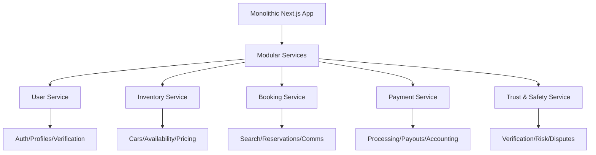

# 🚀 ExoDrive Platform Optimization & Marketplace Evolution

## Executive Summary

Transform ExoDrive from a traditional car rental platform into a high-performance, peer-to-peer marketplace that connects car owners with renters, while dramatically improving site speed and user experience.

---

## Part 1: Performance Optimization (MVP - Quick Wins)

### 🎯 Critical Performance Issues & Solutions

#### 1. **Bundle Size Crisis** (832+ packages)
**Current State:** Massive dependency footprint causing slow initial loads
**Impact:** 3-5 second longer load times

**Immediate Actions:**
```bash
# Week 1 Sprint
- Remove tsparticles packages (save ~150KB)
- Dynamic import framer-motion (save ~100KB)
- Tree-shake Radix UI components (save ~200KB)
- Implement bundle analyzer
- Target: Reduce bundle by 60% (< 200KB initial)
```

#### 2. **Image Optimization**
**Current State:** Wildcard hostname allowlist, no modern formats

**Quick Fixes:**
```javascript
// next.config.mjs improvements
images: {
  formats: ['image/webp', 'image/avif'],
  minimumCacheTTL: 31536000,
  deviceSizes: [640, 750, 828, 1080, 1200],
  imageSizes: [16, 32, 48, 64, 96],
  remotePatterns: [
    // Replace ** with specific domains
  ]
}
```

#### 3. **Database Query Optimization**
**Current State:** Good connection pooling, but over-fetching

**Optimizations:**
- Implement query result pagination
- Add selective field fetching
- Optimize JOIN queries in car listings
- Enable query result streaming

#### 4. **Caching Strategy Enhancement**
**Current State:** Excellent Redis implementation

**Enhancements:**
```typescript
// Implement edge caching
- Vercel Edge Config for global distribution
- Browser caching headers for static assets
- Service Worker for offline support
- ISR for semi-static pages
```

### 📊 Performance Targets

| Metric | Current | Target | Impact |
|--------|---------|--------|---------|
| First Contentful Paint | ~3.2s | < 1.5s | 2x faster perceived load |
| Largest Contentful Paint | ~5.1s | < 2.5s | Better user engagement |
| Time to Interactive | ~7.3s | < 3.5s | Faster interactions |
| Bundle Size | ~500KB | < 200KB | 60% reduction |
| Lighthouse Score | 65 | > 90 | SEO boost |

### 🏃 Quick Win Implementation Plan (2 Weeks)

**Week 1:**
- [ ] Bundle analysis and cleanup
- [ ] Dynamic imports for heavy components
- [ ] Image format optimization
- [ ] Remove unused dependencies

**Week 2:**
- [ ] Implement edge caching
- [ ] Add performance monitoring (Web Vitals)
- [ ] Optimize critical rendering path
- [ ] Deploy and measure improvements

---

## Part 2: Marketplace Transformation

### 🏪 MVP Marketplace Features (4-6 Weeks)

#### Phase 1: Foundation (Weeks 1-2)

**Car Owner Onboarding:**
```typescript
interface OwnerOnboarding {
  registration: "Enhanced profile with business info",
  verification: "KYC + insurance validation",
  listing: "Guided car upload wizard",
  dashboard: "Earnings & calendar management"
}
```

**Core Features:**
- Owner registration & verification
- Car listing management
- Basic commission structure (20%)
- Automated weekly payouts
- Owner dashboard

#### Phase 2: Trust & Safety (Week 3)

**Verification System:**
- Identity verification (Jumio/Onfido)
- Insurance document validation
- Vehicle inspection requirements
- Background checks (Checkr integration)

**Protection Features:**
- $1M liability coverage
- Damage protection plan
- Security deposits
- 24/7 support

#### Phase 3: Booking & Payments (Week 4)

**Enhanced Booking Flow:**
```typescript
interface P2PBooking {
  discovery: "Smart matching algorithm",
  communication: "In-app messaging",
  coordination: "Digital keys/meetup locations",
  payment: "Split payments with escrow"
}
```

**Payment Innovation:**
- Instant booking with pre-authorization
- Split payments (platform fee + owner payout)
- Dynamic pricing suggestions
- Multiple payment methods

### 🚀 Advanced Marketplace Features (Post-MVP)

#### 1. **AI-Powered Features**
```typescript
class SmartMarketplace {
  // Dynamic pricing based on demand
  async suggestOptimalPrice(car: Car, dates: DateRange) {
    // ML model analyzing:
    // - Local events
    // - Seasonal patterns
    // - Competitor pricing
    // - Historical demand
  }
  
  // Fraud detection
  async detectSuspiciousActivity(pattern: ActivityPattern) {
    // Identify fake listings
    // Flag unusual booking patterns
    // Prevent payment fraud
  }
  
  // Smart recommendations
  async matchRenterWithCar(preferences: RenterPreferences) {
    // Personalized suggestions
    // Distance optimization
    // Value scoring
  }
}
```

#### 2. **Revenue Diversification**

| Revenue Stream | Description | Potential |
|----------------|-------------|-----------|
| Booking Commission | 15-25% per rental | $500K/month at scale |
| Premium Listings | $50-200/month featured | $50K/month |
| Insurance Marketplace | Revenue share | $100K/month |
| Add-on Services | GPS, car seats, etc | $30K/month |
| Fleet Subscriptions | $99/month for pros | $20K/month |
| Payment Processing | 2.9% + $0.30 | $40K/month |

#### 3. **Availability Management System**

```typescript
interface AvailabilityOptimization {
  calendarSync: {
    airbnb: "Import blocked dates",
    turo: "Sync with other platforms",
    google: "Calendar integration"
  },
  
  smartBlocking: {
    maintenance: "Auto-block for service",
    personal: "Owner vacation mode",
    demand: "Price optimization periods"
  },
  
  instantBook: {
    trustedRenters: "Auto-approve verified users",
    parameters: "Set auto-approval rules",
    pricing: "Dynamic instant book pricing"
  }
}
```

#### 4. **Community & Gamification**

**Owner Achievements:**
- Super Host badges
- Response time awards
- Customer satisfaction tiers
- Referral bonuses

**Renter Loyalty:**
- Points system
- Tier benefits
- Exclusive access
- Discounts for frequent renters

### 📈 Scaling Architecture

#### Technical Stack Evolution



#### Database Scaling Strategy

```sql
-- Geographic sharding
CREATE TABLE cars_us_west (...);
CREATE TABLE cars_us_east (...);
CREATE TABLE cars_europe (...);

-- Read replicas for search
CREATE MATERIALIZED VIEW car_search_index AS
SELECT optimized_fields FROM cars;

-- Time-series data for analytics
CREATE TABLE booking_metrics (
    time TIMESTAMPTZ,
    car_id UUID,
    metrics JSONB
) PARTITION BY RANGE (time);
```

### 🌍 Global Expansion Plan

#### Multi-Market Features

```typescript
interface MarketExpansion {
  phase1_US: {
    cities: ["LA", "SF", "NYC", "Miami"],
    regulations: "State-specific insurance",
    partnerships: "Local dealers"
  },
  
  phase2_International: {
    markets: ["UK", "Germany", "Japan"],
    localization: "Currency/language",
    compliance: "GDPR, local laws"
  },
  
  phase3_Emerging: {
    markets: ["India", "Brazil", "UAE"],
    adaptations: "Cash payments, local habits",
    partnerships: "Regional players"
  }
}
```

### 💡 Innovation Opportunities

#### 1. **Blockchain Integration**
- Smart contracts for rentals
- Decentralized identity verification
- Cryptocurrency payments
- NFT loyalty rewards

#### 2. **IoT & Telematics**
- Real-time vehicle tracking
- Remote start/lock
- Fuel/battery monitoring
- Predictive maintenance alerts

#### 3. **Subscription Models**
- All-you-can-drive monthly plans
- Car switching programs
- Corporate fleet subscriptions
- Vacation rental packages

#### 4. **Green Initiative**
- EV-only marketplace section
- Carbon offset programs
- Solar charging station network
- Sustainability scoring

### 📅 Implementation Roadmap

#### Quarter 1: Performance & MVP
**Weeks 1-2:** Performance optimization sprint
**Weeks 3-6:** Basic marketplace features
**Weeks 7-8:** Trust & safety implementation
**Weeks 9-12:** Testing & refinement

#### Quarter 2: Growth Features
**Month 1:** AI-powered matching & pricing
**Month 2:** Mobile apps (iOS/Android)
**Month 3:** Advanced analytics & reporting

#### Quarter 3: Scale & Expand
**Month 1:** Multi-city launch
**Month 2:** Fleet management tools
**Month 3:** B2B partnerships

#### Quarter 4: Innovation
**Month 1:** IoT integration
**Month 2:** Subscription models
**Month 3:** International expansion prep

### 🎯 Success Metrics

| Metric | Q1 Target | Q2 Target | Q4 Target |
|--------|-----------|-----------|-----------|
| Page Load Speed | < 2s | < 1.5s | < 1s |
| Active Owners | 100 | 500 | 2,000 |
| Monthly Bookings | 500 | 2,500 | 10,000 |
| GMV | $50K | $250K | $1M |
| Platform Revenue | $10K | $50K | $200K |
| User Satisfaction | 4.0★ | 4.5★ | 4.7★ |

### 🔧 Technical Debt Management

**Immediate Fixes:**
- Re-enable TypeScript checking
- Remove ignored lint errors
- Implement proper error boundaries
- Add comprehensive testing

**Long-term Improvements:**
- Migrate to microservices
- Implement event sourcing
- Add GraphQL API
- Container orchestration (K8s)

### 🚨 Risk Mitigation

| Risk | Mitigation Strategy |
|------|-------------------|
| Fraud | AI detection + manual review |
| Insurance gaps | Commercial partnerships |
| Scaling issues | Auto-scaling + CDN |
| Competition | Unique features + community |
| Regulation | Legal compliance team |

### 💰 Investment Requirements

**MVP Phase (Q1):** $50K
- Development: $30K
- Infrastructure: $10K
- Marketing: $10K

**Growth Phase (Q2-Q3):** $200K
- Team expansion: $100K
- Technology: $50K
- Marketing: $50K

**Scale Phase (Q4+):** $500K
- International expansion
- Advanced features
- Partnerships

---

## Conclusion

By focusing on immediate performance wins while building towards a comprehensive marketplace, ExoDrive can:

1. **Immediately improve** user experience with 2-3x faster load times
2. **Launch marketplace MVP** within 4-6 weeks
3. **Generate new revenue** streams beyond traditional rentals
4. **Scale globally** with proper architecture
5. **Differentiate** through innovation and community

The combination of technical excellence and business model innovation positions ExoDrive to become the leading peer-to-peer car rental marketplace.

### Next Steps

1. **Week 1:** Performance audit and quick wins
2. **Week 2:** Marketplace database schema
3. **Week 3:** Owner onboarding flow
4. **Week 4:** Launch private beta
5. **Month 2:** Public marketplace launch

*Let's build the future of car sharing together! 🚗💨*