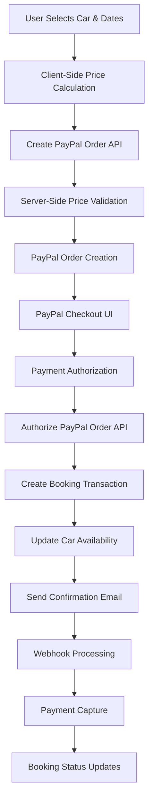

# Payment Integration PRD - Technical Architecture

## Executive Summary

This document outlines the comprehensive technical architecture for ExoDrive's payment integration system, building upon the existing PayPal implementation and designing for future multi-provider support including Stripe. The architecture emphasizes security, scalability, reliability, and maintainability while ensuring PCI compliance.

## 1. Payment Flow Architecture

### 1.1 End-to-End Payment Processing Flow



### 1.2 Integration Points

#### Frontend → Backend
- **Payment Order Creation**: `POST /api/bookings/create-paypal-order`
- **Payment Authorization**: `POST /api/bookings/authorize-paypal-order`
- **Payment Capture**: `POST /api/bookings/[bookingId]/capture-payment`
- **Payment Void**: `POST /api/bookings/[bookingId]/void-payment`

#### Backend → Payment Provider
- **PayPal API Base URLs**:
  - Sandbox: `https://api-m.sandbox.paypal.com`
  - Production: `https://api-m.paypal.com`
- **Key Endpoints**:
  - OAuth: `/v1/oauth2/token`
  - Orders: `/v2/checkout/orders`
  - Webhook Verification: `/v1/notifications/verify-webhook-signature`

#### Payment Provider → Backend
- **Webhook Endpoints**:
  - PayPal: `POST /api/webhooks/paypal`
  - Future Stripe: `POST /api/webhooks/stripe`

### 1.3 State Management Throughout Payment Lifecycle

#### Payment States
```typescript
enum PaymentStatus {
  PENDING = 'pending',
  AUTHORIZED = 'authorized',
  CAPTURED = 'captured',
  VOIDED = 'voided',
  FAILED = 'failed',
  REFUNDED = 'refunded',
  DISPUTED = 'disputed'
}
```

#### Booking States
```typescript
enum BookingStatus {
  PENDING_PAYMENT = 'pending_payment',
  PENDING_CONTRACT = 'pending_contract',
  UPCOMING = 'upcoming',
  ACTIVE = 'active',
  COMPLETED = 'completed',
  CANCELLED = 'cancelled',
  DISPUTED = 'disputed'
}
```

### 1.4 Webhook Handling and Asynchronous Processing

The system implements a robust webhook processing system with:

- **Signature Verification**: All webhooks are cryptographically verified
- **Idempotency**: Duplicate webhooks are handled gracefully
- **Retry Logic**: Failed webhook processing includes exponential backoff
- **Dead Letter Queue**: Permanently failed webhooks are stored for manual review

## 2. Technical Implementation Details

### 2.1 API Endpoint Specifications

#### Create PayPal Order
```typescript
// POST /api/bookings/create-paypal-order
interface CreateOrderRequest {
  carId: string;
  startDate: string;
  endDate: string;
  bookingId: string;
  description?: string;
}

interface CreateOrderResponse {
  orderID: string;
}
```

#### Authorize PayPal Order
```typescript
// POST /api/bookings/authorize-paypal-order
interface AuthorizeOrderRequest {
  orderID: string;
  bookingDetails: {
    carId: string;
    startDate: string;
    endDate: string;
    totalPrice: number;
    customer: CustomerDetails;
  };
}

interface AuthorizeOrderResponse {
  success: boolean;
  bookingId: string;
  authorizationId: string;
  authorizedData: PayPalAuthorizationData;
}
```

#### Capture Payment
```typescript
// POST /api/bookings/[bookingId]/capture-payment
interface CapturePaymentRequest {
  amount?: number; // Optional for partial capture
  finalCapture?: boolean;
}

interface CapturePaymentResponse {
  success: boolean;
  captureId: string;
  capturedAmount: number;
}
```

### 2.2 Database Schema Requirements

#### Core Payment Tables
```sql
-- Payments table
CREATE TABLE payments (
  id UUID PRIMARY KEY DEFAULT gen_random_uuid(),
  booking_id UUID NOT NULL REFERENCES bookings(id),
  amount DECIMAL(10,2) NOT NULL,
  currency VARCHAR(3) DEFAULT 'USD',
  status payment_status_enum NOT NULL DEFAULT 'pending',
  
  -- PayPal specific fields
  paypal_order_id VARCHAR(255),
  paypal_authorization_id VARCHAR(255),
  paypal_invoice_id VARCHAR(255),
  
  -- Future Stripe fields (nullable for now)
  stripe_payment_intent_id VARCHAR(255),
  stripe_payment_method_id VARCHAR(255),
  
  captured_at TIMESTAMPTZ,
  created_at TIMESTAMPTZ DEFAULT NOW(),
  updated_at TIMESTAMPTZ DEFAULT NOW()
);

-- Payment events for audit trail
CREATE TABLE payment_events (
  id UUID PRIMARY KEY DEFAULT gen_random_uuid(),
  payment_id UUID NOT NULL REFERENCES payments(id),
  event_type payment_event_type_enum NOT NULL,
  provider_event_id VARCHAR(255),
  amount DECIMAL(10,2),
  provider_data JSONB,
  created_at TIMESTAMPTZ DEFAULT NOW()
);

-- Webhook processing log
CREATE TABLE webhook_processing_log (
  id UUID PRIMARY KEY DEFAULT gen_random_uuid(),
  webhook_id VARCHAR(255) NOT NULL,
  webhook_type webhook_type_enum NOT NULL,
  booking_id UUID REFERENCES bookings(id),
  processing_status webhook_processing_status_enum DEFAULT 'processed',
  processing_result JSONB,
  processed_at TIMESTAMPTZ DEFAULT NOW(),
  
  UNIQUE(webhook_id, webhook_type)
);

-- Webhook retry system
CREATE TABLE webhook_retries (
  id UUID PRIMARY KEY DEFAULT gen_random_uuid(),
  webhook_id VARCHAR(255) NOT NULL,
  webhook_type webhook_type_enum NOT NULL,
  payload JSONB NOT NULL,
  headers JSONB,
  endpoint_url TEXT NOT NULL,
  booking_id UUID REFERENCES bookings(id),
  
  status webhook_retry_status_enum DEFAULT 'pending',
  attempt_count INT DEFAULT 0,
  max_attempts INT DEFAULT 5,
  
  next_retry_at TIMESTAMPTZ,
  last_attempt_at TIMESTAMPTZ,
  succeeded_at TIMESTAMPTZ,
  failed_permanently_at TIMESTAMPTZ,
  
  error_message TEXT,
  error_details JSONB,
  
  created_at TIMESTAMPTZ DEFAULT NOW(),
  updated_at TIMESTAMPTZ DEFAULT NOW()
);
```

### 2.3 Payment Method Abstraction Layer

```typescript
// Abstract payment provider interface
interface PaymentProvider {
  name: string;
  createOrder(params: CreateOrderParams): Promise<OrderResponse>;
  authorizePayment(orderId: string): Promise<AuthorizationResponse>;
  capturePayment(authId: string, amount?: number): Promise<CaptureResponse>;
  voidPayment(authId: string): Promise<VoidResponse>;
  refundPayment(captureId: string, amount?: number): Promise<RefundResponse>;
  verifyWebhook(request: WebhookRequest): Promise<boolean>;
  processWebhook(webhook: WebhookData): Promise<WebhookResult>;
}

// PayPal implementation
class PayPalProvider implements PaymentProvider {
  name = 'paypal';
  
  async createOrder(params: CreateOrderParams): Promise<OrderResponse> {
    const accessToken = await getPayPalAccessToken();
    // Implementation details...
  }
  
  // Other method implementations...
}

// Future Stripe implementation
class StripeProvider implements PaymentProvider {
  name = 'stripe';
  
  async createOrder(params: CreateOrderParams): Promise<OrderResponse> {
    // Stripe implementation
  }
  
  // Other method implementations...
}

// Payment service factory
class PaymentService {
  private providers = new Map<string, PaymentProvider>();
  
  constructor() {
    this.providers.set('paypal', new PayPalProvider());
    // this.providers.set('stripe', new StripeProvider());
  }
  
  getProvider(name: string): PaymentProvider {
    const provider = this.providers.get(name);
    if (!provider) {
      throw new Error(`Payment provider ${name} not found`);
    }
    return provider;
  }
}
```

### 2.4 Idempotency and Retry Mechanisms

#### Idempotency Implementation
```typescript
class IdempotencyService {
  private redis: RedisClient;
  
  async executeWithIdempotency<T>(
    key: string,
    operation: () => Promise<T>,
    ttlSeconds: number = 3600
  ): Promise<T> {
    // Check if operation was already executed
    const cached = await this.redis.get(`idempotency:${key}`);
    if (cached) {
      return JSON.parse(cached);
    }
    
    // Execute operation
    const result = await operation();
    
    // Cache result
    await this.redis.setex(`idempotency:${key}`, ttlSeconds, JSON.stringify(result));
    
    return result;
  }
}

// Usage in payment endpoints
app.post('/api/bookings/create-paypal-order', async (req, res) => {
  const idempotencyKey = req.headers['idempotency-key'] || 
    `order-${req.body.bookingId}-${Date.now()}`;
  
  const result = await idempotencyService.executeWithIdempotency(
    idempotencyKey,
    () => createPayPalOrder(req.body)
  );
  
  res.json(result);
});
```

#### Retry Logic with Exponential Backoff
```typescript
class RetryService {
  async executeWithRetry<T>(
    operation: () => Promise<T>,
    maxAttempts: number = 3,
    baseDelay: number = 1000
  ): Promise<T> {
    let lastError: Error;
    
    for (let attempt = 1; attempt <= maxAttempts; attempt++) {
      try {
        return await operation();
      } catch (error) {
        lastError = error as Error;
        
        if (attempt === maxAttempts) {
          throw lastError;
        }
        
        // Exponential backoff with jitter
        const delay = baseDelay * Math.pow(2, attempt - 1) + 
                     Math.random() * 1000;
        await this.sleep(delay);
      }
    }
    
    throw lastError!;
  }
  
  private sleep(ms: number): Promise<void> {
    return new Promise(resolve => setTimeout(resolve, ms));
  }
}
```

### 2.5 Rate Limiting and Throttling Strategies

```typescript
// Rate limiting configuration
const rateLimitConfig = {
  paypal: {
    orderCreation: { requests: 100, window: '1h' },
    webhooks: { requests: 1000, window: '1h' }
  },
  stripe: {
    paymentIntents: { requests: 100, window: '1h' },
    webhooks: { requests: 1000, window: '1h' }
  }
};

// Rate limiter implementation using Redis
class RateLimiter {
  async checkLimit(key: string, limit: number, windowMs: number): Promise<boolean> {
    const current = await this.redis.incr(key);
    
    if (current === 1) {
      await this.redis.expire(key, Math.floor(windowMs / 1000));
    }
    
    return current <= limit;
  }
}

// Apply rate limiting to payment endpoints
const paymentRateLimit = rateLimit({
  keyGenerator: (req) => `payment:${req.ip}`,
  max: 10, // 10 requests per window
  windowMs: 60 * 1000, // 1 minute
  message: 'Too many payment requests, please try again later'
});
```

## 3. Payment Provider Integration

### 3.1 Current PayPal Implementation Overview

#### Authentication & Token Management
- OAuth 2.0 client credentials flow
- Access tokens cached in Redis with 8-hour TTL
- Automatic token refresh on expiration

#### Key Features Implemented
- Order creation with AUTHORIZE intent
- Payment authorization (hold funds)
- Payment capture (settle funds)
- Payment void (release hold)
- Webhook signature verification
- Comprehensive error handling

#### PayPal-Specific Configurations
```typescript
const paypalConfig = {
  environment: process.env.PAYPAL_MODE === 'sandbox' ? 'sandbox' : 'production',
  clientId: process.env.PAYPAL_CLIENT_ID,
  clientSecret: process.env.PAYPAL_CLIENT_SECRET,
  webhookId: process.env.PAYPAL_WEBHOOK_ID,
  apiVersion: 'v2',
  returnUrl: `${process.env.NEXT_PUBLIC_URL}/booking/confirmation`,
  cancelUrl: `${process.env.NEXT_PUBLIC_URL}/booking/cancelled`
};
```

### 3.2 Future Stripe Integration Architecture

#### Stripe Configuration Structure
```typescript
const stripeConfig = {
  publishableKey: process.env.STRIPE_PUBLISHABLE_KEY,
  secretKey: process.env.STRIPE_SECRET_KEY,
  webhookSecret: process.env.STRIPE_WEBHOOK_SECRET,
  apiVersion: '2023-10-16',
  paymentMethods: ['card', 'klarna', 'afterpay_clearpay'],
  currency: 'usd'
};

// Stripe Payment Intent creation
async function createStripePaymentIntent(params: CreateOrderParams) {
  const stripe = new Stripe(stripeConfig.secretKey);
  
  return await stripe.paymentIntents.create({
    amount: Math.round(params.amount * 100), // Convert to cents
    currency: params.currency,
    payment_method_types: ['card'],
    capture_method: 'manual', // Authorize only
    metadata: {
      bookingId: params.bookingId,
      carId: params.carId,
      startDate: params.startDate,
      endDate: params.endDate
    },
    description: `ExoDrive booking for ${params.carName}`
  });
}
```

### 3.3 Provider-Agnostic Payment Abstraction Layer

```typescript
// Unified payment interface
interface PaymentTransaction {
  id: string;
  bookingId: string;
  amount: number;
  currency: string;
  status: PaymentStatus;
  provider: 'paypal' | 'stripe';
  providerTransactionId: string;
  authorizationId?: string;
  captureId?: string;
  metadata: Record<string, any>;
  createdAt: Date;
  updatedAt: Date;
}

// Payment manager that abstracts provider differences
class PaymentManager {
  private providers: Map<string, PaymentProvider>;
  private defaultProvider: string;
  
  constructor() {
    this.providers = new Map();
    this.providers.set('paypal', new PayPalProvider());
    this.providers.set('stripe', new StripeProvider());
    this.defaultProvider = process.env.DEFAULT_PAYMENT_PROVIDER || 'paypal';
  }
  
  async createPayment(params: CreatePaymentParams): Promise<PaymentTransaction> {
    const provider = this.getProvider(params.preferredProvider || this.defaultProvider);
    const result = await provider.createOrder(params);
    
    // Store in database with provider-agnostic format
    return await this.storePaymentTransaction({
      ...result,
      provider: provider.name
    });
  }
  
  async processWebhook(providerName: string, webhook: any): Promise<void> {
    const provider = this.getProvider(providerName);
    
    // Verify webhook signature
    const isValid = await provider.verifyWebhook(webhook);
    if (!isValid) {
      throw new Error('Invalid webhook signature');
    }
    
    // Process webhook
    await provider.processWebhook(webhook);
  }
  
  private getProvider(name: string): PaymentProvider {
    const provider = this.providers.get(name);
    if (!provider) {
      throw new Error(`Payment provider ${name} not supported`);
    }
    return provider;
  }
}
```

### 3.4 Configuration Management for Multiple Providers

```typescript
// Environment-based configuration
interface PaymentProviderConfig {
  enabled: boolean;
  priority: number;
  config: Record<string, any>;
  supportedCurrencies: string[];
  supportedCountries: string[];
  features: {
    authorization: boolean;
    partialCapture: boolean;
    refunds: boolean;
    webhooks: boolean;
    recurringPayments: boolean;
  };
}

const providerConfigs: Record<string, PaymentProviderConfig> = {
  paypal: {
    enabled: process.env.PAYPAL_ENABLED === 'true',
    priority: 1,
    config: {
      clientId: process.env.PAYPAL_CLIENT_ID,
      clientSecret: process.env.PAYPAL_CLIENT_SECRET,
      mode: process.env.PAYPAL_MODE || 'sandbox',
      webhookId: process.env.PAYPAL_WEBHOOK_ID
    },
    supportedCurrencies: ['USD', 'EUR', 'GBP', 'CAD'],
    supportedCountries: ['US', 'CA', 'GB', 'AU'],
    features: {
      authorization: true,
      partialCapture: true,
      refunds: true,
      webhooks: true,
      recurringPayments: true
    }
  },
  stripe: {
    enabled: process.env.STRIPE_ENABLED === 'true',
    priority: 2,
    config: {
      publishableKey: process.env.STRIPE_PUBLISHABLE_KEY,
      secretKey: process.env.STRIPE_SECRET_KEY,
      webhookSecret: process.env.STRIPE_WEBHOOK_SECRET
    },
    supportedCurrencies: ['USD', 'EUR', 'GBP', 'CAD', 'AUD'],
    supportedCountries: ['US', 'CA', 'GB', 'AU', 'DE', 'FR'],
    features: {
      authorization: true,
      partialCapture: true,
      refunds: true,
      webhooks: true,
      recurringPayments: true
    }
  }
};
```

### 3.5 Provider Failover and Redundancy

```typescript
class PaymentProviderManager {
  private providers: PaymentProvider[];
  
  constructor() {
    this.providers = this.getEnabledProviders()
      .sort((a, b) => a.priority - b.priority);
  }
  
  async createPaymentWithFailover(params: CreatePaymentParams): Promise<PaymentResult> {
    let lastError: Error;
    
    for (const provider of this.providers) {
      try {
        // Check if provider supports the currency/country
        if (!this.isProviderSupported(provider, params)) {
          continue;
        }
        
        const result = await provider.createPayment(params);
        return { ...result, provider: provider.name };
        
      } catch (error) {
        lastError = error as Error;
        console.warn(`Payment failed with ${provider.name}:`, error);
        
        // Log provider failure for monitoring
        await this.logProviderFailure(provider.name, error, params);
      }
    }
    
    throw new Error(`All payment providers failed. Last error: ${lastError?.message}`);
  }
  
  private isProviderSupported(provider: PaymentProvider, params: CreatePaymentParams): boolean {
    const config = providerConfigs[provider.name];
    return config.supportedCurrencies.includes(params.currency) &&
           config.supportedCountries.includes(params.country);
  }
}
```

## 4. Transaction Management

### 4.1 Authorization vs Capture Flows

#### Authorization Flow (Current Implementation)
```typescript
// Step 1: Create order with AUTHORIZE intent
const order = await paypal.createOrder({
  intent: 'AUTHORIZE',
  amount: totalPrice,
  reference: bookingId
});

// Step 2: Customer completes payment - funds are held
const authorization = await paypal.authorizeOrder(order.id);

// Step 3: Create booking in database
const booking = await createBookingWithAuthorization({
  authorizationId: authorization.id,
  status: 'authorized'
});

// Step 4: Capture payment when booking is confirmed
const capture = await paypal.captureAuthorization(authorization.id, amount);
```

#### Capture Flow (Alternative)
```typescript
// Direct capture - funds are immediately transferred
const order = await paypal.createOrder({
  intent: 'CAPTURE',
  amount: totalPrice,
  reference: bookingId
});

const capture = await paypal.captureOrder(order.id);
```

### 4.2 Partial Payment Handling

```typescript
interface PartialPaymentConfig {
  enabled: boolean;
  minimumPercentage: number; // e.g., 20% minimum upfront
  allowedSplits: number[]; // e.g., [20, 80] for 20% upfront, 80% later
  scheduleType: 'fixed_date' | 'relative_to_booking';
}

class PartialPaymentManager {
  async createPartialPaymentSchedule(
    bookingId: string,
    totalAmount: number,
    schedule: PaymentSchedule[]
  ): Promise<PartialPaymentPlan> {
    // Validate schedule totals to 100%
    const totalPercentage = schedule.reduce((sum, s) => sum + s.percentage, 0);
    if (Math.abs(totalPercentage - 100) > 0.01) {
      throw new Error('Payment schedule must total 100%');
    }
    
    // Create payment plan
    const plan = await this.database.createPaymentPlan({
      bookingId,
      totalAmount,
      schedule: schedule.map((s, index) => ({
        sequenceNumber: index + 1,
        amount: totalAmount * (s.percentage / 100),
        dueDate: this.calculateDueDate(s),
        status: 'pending'
      }))
    });
    
    return plan;
  }
}
```

### 4.3 Refund and Void Operations

```typescript
class RefundManager {
  async processRefund(
    paymentId: string,
    amount?: number,
    reason?: string
  ): Promise<RefundResult> {
    const payment = await this.getPayment(paymentId);
    const provider = this.getProvider(payment.provider);
    
    // Determine refund amount
    const refundAmount = amount || payment.capturedAmount;
    
    // Validate refund amount
    if (refundAmount > payment.capturedAmount) {
      throw new Error('Refund amount cannot exceed captured amount');
    }
    
    // Process refund with provider
    const refund = await provider.refundPayment(
      payment.providerCaptureId,
      refundAmount,
      reason
    );
    
    // Update database
    await this.database.createRefund({
      paymentId,
      amount: refundAmount,
      providerRefundId: refund.id,
      reason,
      status: 'completed'
    });
    
    // Update payment status
    if (refundAmount === payment.capturedAmount) {
      await this.database.updatePayment(paymentId, { status: 'refunded' });
    } else {
      await this.database.updatePayment(paymentId, { status: 'partially_refunded' });
    }
    
    return refund;
  }
  
  async voidAuthorization(authorizationId: string): Promise<VoidResult> {
    const authorization = await this.getAuthorization(authorizationId);
    const provider = this.getProvider(authorization.provider);
    
    // Can only void uncaptured authorizations
    if (authorization.status !== 'authorized') {
      throw new Error('Can only void authorized payments');
    }
    
    const voidResult = await provider.voidPayment(authorization.providerAuthId);
    
    // Update database
    await this.database.updateAuthorization(authorizationId, {
      status: 'voided',
      voidedAt: new Date()
    });
    
    return voidResult;
  }
}
```

### 4.4 Dispute and Chargeback Management

```typescript
interface Dispute {
  id: string;
  paymentId: string;
  bookingId: string;
  amount: number;
  reason: string;
  status: 'open' | 'under_review' | 'resolved' | 'lost';
  providerDisputeId: string;
  evidence?: DisputeEvidence[];
  resolution?: DisputeResolution;
  createdAt: Date;
  resolvedAt?: Date;
}

class DisputeManager {
  async handleIncomingDispute(webhook: DisputeWebhook): Promise<void> {
    // Create dispute record
    const dispute = await this.database.createDispute({
      paymentId: webhook.paymentId,
      amount: webhook.amount,
      reason: webhook.reason,
      providerDisputeId: webhook.disputeId,
      status: 'open'
    });
    
    // Update booking status
    await this.database.updateBooking(dispute.bookingId, {
      status: 'disputed'
    });
    
    // Notify admin team
    await this.notificationService.sendDisputeAlert({
      disputeId: dispute.id,
      bookingId: dispute.bookingId,
      amount: dispute.amount,
      reason: dispute.reason
    });
    
    // Auto-collect evidence
    await this.collectDisputeEvidence(dispute.id);
  }
  
  async submitDisputeResponse(
    disputeId: string,
    evidence: DisputeEvidence[]
  ): Promise<void> {
    const dispute = await this.getDispute(disputeId);
    const provider = this.getProvider(dispute.provider);
    
    await provider.submitDisputeResponse(dispute.providerDisputeId, evidence);
    
    // Update dispute status
    await this.database.updateDispute(disputeId, {
      status: 'under_review',
      evidence,
      respondedAt: new Date()
    });
  }
}
```

### 4.5 Settlement and Reconciliation

```typescript
class SettlementManager {
  async reconcileDaily(date: Date): Promise<ReconciliationReport> {
    const report = {
      date,
      providers: {} as Record<string, ProviderReconciliation>
    };
    
    for (const providerName of this.enabledProviders) {
      const provider = this.getProvider(providerName);
      
      // Get provider settlements for the date
      const providerSettlements = await provider.getSettlements(date);
      
      // Get our internal records
      const internalTransactions = await this.database.getTransactionsByDate(
        date,
        providerName
      );
      
      // Compare and identify discrepancies
      const reconciliation = await this.compareTransactions(
        providerSettlements,
        internalTransactions
      );
      
      report.providers[providerName] = reconciliation;
      
      // Handle discrepancies
      if (reconciliation.discrepancies.length > 0) {
        await this.handleDiscrepancies(reconciliation.discrepancies);
      }
    }
    
    // Store reconciliation report
    await this.database.storeReconciliationReport(report);
    
    return report;
  }
  
  private async compareTransactions(
    providerData: ProviderTransaction[],
    internalData: InternalTransaction[]
  ): Promise<ReconciliationResult> {
    const discrepancies: Discrepancy[] = [];
    const matches: TransactionMatch[] = [];
    
    // Create lookup maps
    const providerMap = new Map(
      providerData.map(t => [t.referenceId, t])
    );
    const internalMap = new Map(
      internalData.map(t => [t.providerTransactionId, t])
    );
    
    // Find matches and discrepancies
    for (const internal of internalData) {
      const provider = providerMap.get(internal.providerTransactionId);
      
      if (!provider) {
        discrepancies.push({
          type: 'missing_from_provider',
          transaction: internal
        });
      } else if (Math.abs(provider.amount - internal.amount) > 0.01) {
        discrepancies.push({
          type: 'amount_mismatch',
          internal,
          provider
        });
      } else {
        matches.push({ internal, provider });
      }
    }
    
    // Find provider transactions not in our system
    for (const provider of providerData) {
      if (!internalMap.has(provider.id)) {
        discrepancies.push({
          type: 'missing_from_internal',
          transaction: provider
        });
      }
    }
    
    return {
      totalMatches: matches.length,
      totalDiscrepancies: discrepancies.length,
      matches,
      discrepancies,
      reconciliationStatus: discrepancies.length === 0 ? 'clean' : 'has_discrepancies'
    };
  }
}
```

## 5. Error Handling & Recovery

### 5.1 Payment Failure Scenarios and Recovery Strategies

```typescript
enum PaymentErrorType {
  INSUFFICIENT_FUNDS = 'insufficient_funds',
  CARD_DECLINED = 'card_declined',
  PAYMENT_METHOD_INVALID = 'payment_method_invalid',
  FRAUD_DETECTED = 'fraud_detected',
  PROVIDER_DOWN = 'provider_down',
  NETWORK_ERROR = 'network_error',
  TIMEOUT = 'timeout',
  UNKNOWN = 'unknown'
}

interface PaymentErrorHandler {
  canRetry(error: PaymentError): boolean;
  getRetryDelay(error: PaymentError, attempt: number): number;
  getRecoveryAction(error: PaymentError): RecoveryAction;
}

class PaymentErrorManager implements PaymentErrorHandler {
  private readonly retryableErrors = [
    PaymentErrorType.PROVIDER_DOWN,
    PaymentErrorType.NETWORK_ERROR,
    PaymentErrorType.TIMEOUT
  ];
  
  private readonly userActionRequired = [
    PaymentErrorType.INSUFFICIENT_FUNDS,
    PaymentErrorType.CARD_DECLINED,
    PaymentErrorType.PAYMENT_METHOD_INVALID
  ];
  
  canRetry(error: PaymentError): boolean {
    return this.retryableErrors.includes(error.type);
  }
  
  getRetryDelay(error: PaymentError, attempt: number): number {
    const baseDelay = 1000; // 1 second
    const maxDelay = 30000;  // 30 seconds
    
    const delay = Math.min(
      baseDelay * Math.pow(2, attempt - 1),
      maxDelay
    );
    
    // Add jitter to prevent thundering herd
    return delay + Math.random() * 1000;
  }
  
  getRecoveryAction(error: PaymentError): RecoveryAction {
    if (this.userActionRequired.includes(error.type)) {
      return {
        type: 'user_action_required',
        message: this.getUserFriendlyMessage(error),
        suggestedActions: this.getSuggestedActions(error)
      };
    }
    
    if (this.canRetry(error)) {
      return {
        type: 'automatic_retry',
        message: 'Payment is being processed, please wait...'
      };
    }
    
    return {
      type: 'manual_intervention',
      message: 'Payment failed. Our team has been notified.',
      escalationRequired: true
    };
  }
}
```

### 5.2 Timeout Handling and Cleanup Processes

```typescript
class PaymentTimeoutManager {
  private readonly timeouts = new Map<string, NodeJS.Timeout>();
  
  async executeWithTimeout<T>(
    operation: () => Promise<T>,
    timeoutMs: number,
    cleanupFn?: () => Promise<void>
  ): Promise<T> {
    return new Promise<T>((resolve, reject) => {
      const timeoutId = setTimeout(async () => {
        try {
          await cleanupFn?.();
        } catch (cleanupError) {
          console.error('Cleanup failed:', cleanupError);
        }
        reject(new Error(`Operation timed out after ${timeoutMs}ms`));
      }, timeoutMs);
      
      operation()
        .then(result => {
          clearTimeout(timeoutId);
          resolve(result);
        })
        .catch(error => {
          clearTimeout(timeoutId);
          reject(error);
        });
    });
  }
  
  // Cleanup orphaned authorizations
  async cleanupExpiredAuthorizations(): Promise<void> {
    const expiredAuths = await this.database.getExpiredAuthorizations();
    
    for (const auth of expiredAuths) {
      try {
        // Void the authorization if still possible
        await this.voidAuthorization(auth.id);
        
        // Update booking status
        await this.database.updateBooking(auth.bookingId, {
          status: 'payment_failed',
          failureReason: 'authorization_expired'
        });
        
        // Notify customer
        await this.notificationService.sendPaymentExpiredNotification(auth.bookingId);
        
      } catch (error) {
        console.error(`Failed to cleanup expired authorization ${auth.id}:`, error);
      }
    }
  }
}
```

### 5.3 Automatic Retry Logic with Exponential Backoff

```typescript
class WebhookRetryProcessor {
  private readonly maxAttempts = 5;
  private readonly baseDelay = 60000; // 1 minute
  
  async processRetries(): Promise<void> {
    const retries = await this.webhookRetryService.getWebhooksForRetry();
    
    // Process retries in parallel with concurrency limit
    const concurrencyLimit = 5;
    const chunks = this.chunk(retries, concurrencyLimit);
    
    for (const chunk of chunks) {
      await Promise.allSettled(
        chunk.map(retry => this.processRetry(retry))
      );
    }
  }
  
  private async processRetry(retry: WebhookRetry): Promise<void> {
    const result = await this.webhookRetryService.processWebhookRetry(retry);
    
    if (!result.success) {
      if (result.shouldRetry) {
        // Schedule next retry
        const nextDelay = this.calculateRetryDelay(retry.attempt_count);
        const nextRetryAt = new Date(Date.now() + nextDelay);
        
        await this.webhookRetryService.updateWebhookRetry(retry.id, {
          status: 'pending',
          next_retry_at: nextRetryAt.toISOString(),
          attempt_count: retry.attempt_count + 1,
          error_message: result.errorMessage
        });
      } else {
        // Move to dead letter queue
        await this.webhookRetryService.updateWebhookRetry(retry.id, {
          status: 'dead_letter',
          failed_permanently_at: new Date().toISOString(),
          error_message: result.errorMessage
        });
        
        // Alert operations team
        await this.alertService.sendDeadLetterAlert(retry);
      }
    }
  }
  
  private calculateRetryDelay(attemptCount: number): number {
    // Exponential backoff: 1min, 2min, 4min, 8min, 16min
    const delay = this.baseDelay * Math.pow(2, attemptCount);
    
    // Add jitter (±25%)
    const jitter = delay * 0.25 * (Math.random() - 0.5);
    
    return Math.floor(delay + jitter);
  }
}
```

### 5.4 Manual Intervention Workflows

```typescript
interface ManualInterventionTask {
  id: string;
  type: 'payment_stuck' | 'webhook_failed' | 'dispute_response' | 'refund_request';
  priority: 'low' | 'medium' | 'high' | 'urgent';
  bookingId?: string;
  paymentId?: string;
  description: string;
  context: Record<string, any>;
  assignedTo?: string;
  status: 'open' | 'in_progress' | 'resolved' | 'escalated';
  createdAt: Date;
  dueDate?: Date;
}

class ManualInterventionManager {
  async createInterventionTask(
    type: ManualInterventionTask['type'],
    context: Record<string, any>
  ): Promise<ManualInterventionTask> {
    const task: ManualInterventionTask = {
      id: generateId(),
      type,
      priority: this.determinePriority(type, context),
      description: this.generateDescription(type, context),
      context,
      status: 'open',
      createdAt: new Date(),
      dueDate: this.calculateDueDate(type),
      ...this.extractIds(context)
    };
    
    await this.database.storeInterventionTask(task);
    
    // Auto-assign based on type
    await this.autoAssignTask(task);
    
    // Send notifications
    await this.notifyTeam(task);
    
    return task;
  }
  
  async resolvePaymentStuck(taskId: string, resolution: PaymentResolution): Promise<void> {
    const task = await this.getTask(taskId);
    
    switch (resolution.action) {
      case 'retry_payment':
        await this.retryPayment(task.paymentId!);
        break;
        
      case 'void_and_recreate':
        await this.voidPayment(task.paymentId!);
        await this.createNewPayment(task.bookingId!, resolution.newAmount);
        break;
        
      case 'manual_capture':
        await this.manualCapture(task.paymentId!, resolution.captureAmount!);
        break;
        
      case 'cancel_booking':
        await this.cancelBooking(task.bookingId!, resolution.reason!);
        break;
    }
    
    await this.updateTask(taskId, {
      status: 'resolved',
      resolution: resolution,
      resolvedAt: new Date()
    });
  }
  
  // Dashboard for operations team
  async getInterventionDashboard(): Promise<InterventionDashboard> {
    const tasks = await this.database.getOpenInterventionTasks();
    const metrics = await this.calculateMetrics();
    
    return {
      openTasks: tasks.length,
      overdueTasks: tasks.filter(t => t.dueDate && t.dueDate < new Date()).length,
      tasksByType: this.groupBy(tasks, 'type'),
      tasksByPriority: this.groupBy(tasks, 'priority'),
      averageResolutionTime: metrics.averageResolutionTime,
      tasks: tasks.slice(0, 50) // Latest 50 tasks
    };
  }
}
```

## 6. Performance & Scalability

### 6.1 Caching Strategies for Payment Tokens

```typescript
class PaymentTokenCache {
  private redis: RedisClient;
  
  // PayPal access token caching
  async getPayPalAccessToken(): Promise<string> {
    const cacheKey = `paypal:access_token:${process.env.PAYPAL_MODE}`;
    
    // Try cache first
    const cached = await this.redis.get(cacheKey);
    if (cached) {
      return cached;
    }
    
    // Fetch new token
    const token = await this.fetchNewPayPalToken();
    
    // Cache with 8 hour TTL (PayPal tokens expire after 9 hours)
    await this.redis.setex(cacheKey, 28800, token);
    
    return token;
  }
  
  // Stripe ephemeral keys for mobile SDKs
  async createStripeEphemeralKey(customerId: string): Promise<string> {
    const cacheKey = `stripe:ephemeral:${customerId}`;
    
    // Check cache (short TTL for security)
    const cached = await this.redis.get(cacheKey);
    if (cached) {
      return cached;
    }
    
    // Create new ephemeral key
    const ephemeralKey = await this.stripe.ephemeralKeys.create(
      { customer: customerId },
      { apiVersion: '2023-10-16' }
    );
    
    // Cache for 1 hour
    await this.redis.setex(cacheKey, 3600, ephemeralKey.secret);
    
    return ephemeralKey.secret;
  }
  
  // Payment method caching for returning customers
  async cachePaymentMethods(customerId: string): Promise<void> {
    const cacheKey = `payment_methods:${customerId}`;
    
    // Get payment methods from all providers
    const paymentMethods = await Promise.all([
      this.getPayPalSavedMethods(customerId),
      this.getStripeSavedMethods(customerId)
    ]);
    
    const combined = paymentMethods.flat();
    
    // Cache for 30 minutes
    await this.redis.setex(cacheKey, 1800, JSON.stringify(combined));
  }
}
```

### 6.2 Database Optimization for Payment Queries

```sql
-- Indexes for payment queries
CREATE INDEX CONCURRENTLY idx_payments_booking_id ON payments(booking_id);
CREATE INDEX CONCURRENTLY idx_payments_status_created ON payments(status, created_at DESC);
CREATE INDEX CONCURRENTLY idx_payments_provider_status ON payments(paypal_order_id, status) WHERE paypal_order_id IS NOT NULL;
CREATE INDEX CONCURRENTLY idx_payments_stripe_intent ON payments(stripe_payment_intent_id) WHERE stripe_payment_intent_id IS NOT NULL;

-- Composite index for webhook processing
CREATE INDEX CONCURRENTLY idx_webhook_processing_type_id ON webhook_processing_log(webhook_type, webhook_id);

-- Index for retry processing
CREATE INDEX CONCURRENTLY idx_webhook_retries_ready ON webhook_retries(status, next_retry_at) 
WHERE status IN ('pending', 'processing') AND next_retry_at IS NOT NULL;

-- Partial index for active bookings
CREATE INDEX CONCURRENTLY idx_bookings_active_payments ON bookings(id, payment_status) 
WHERE payment_status IN ('pending', 'authorized');

-- Index for reconciliation queries
CREATE INDEX CONCURRENTLY idx_payments_date_provider ON payments(DATE(created_at), paypal_order_id) 
WHERE paypal_order_id IS NOT NULL;
```

### 6.3 Load Balancing for Payment Processing

```typescript
// Payment processor pool
class PaymentProcessorPool {
  private processors: PaymentProcessor[];
  private currentIndex = 0;
  
  constructor(poolSize: number = 5) {
    this.processors = Array.from(
      { length: poolSize },
      () => new PaymentProcessor()
    );
  }
  
  // Round-robin load balancing
  getNextProcessor(): PaymentProcessor {
    const processor = this.processors[this.currentIndex];
    this.currentIndex = (this.currentIndex + 1) % this.processors.length;
    return processor;
  }
  
  // Health check and automatic failover
  async getHealthyProcessor(): Promise<PaymentProcessor> {
    for (const processor of this.processors) {
      if (await processor.isHealthy()) {
        return processor;
      }
    }
    
    throw new Error('No healthy payment processors available');
  }
  
  // Process with automatic retry across processors
  async processWithFailover<T>(
    operation: (processor: PaymentProcessor) => Promise<T>
  ): Promise<T> {
    let lastError: Error;
    
    for (let attempt = 0; attempt < this.processors.length; attempt++) {
      try {
        const processor = this.getNextProcessor();
        return await operation(processor);
      } catch (error) {
        lastError = error as Error;
        console.warn(`Payment processor failed, trying next:`, error);
      }
    }
    
    throw lastError!;
  }
}

// API gateway with load balancing
class PaymentAPIGateway {
  private processorPool: PaymentProcessorPool;
  private rateLimiter: RateLimiter;
  
  constructor() {
    this.processorPool = new PaymentProcessorPool();
    this.rateLimiter = new RateLimiter();
  }
  
  async handlePaymentRequest(request: PaymentRequest): Promise<PaymentResponse> {
    // Apply rate limiting
    const allowed = await this.rateLimiter.checkLimit(
      `payment:${request.ip}`,
      10, // 10 requests per minute
      60000
    );
    
    if (!allowed) {
      throw new Error('Rate limit exceeded');
    }
    
    // Process with failover
    return await this.processorPool.processWithFailover(async (processor) => {
      return await processor.processPayment(request);
    });
  }
}
```

### 6.4 Queue-Based Processing for High Volume

```typescript
// Payment processing queue
class PaymentQueue {
  private queue: Queue<PaymentJob>;
  private workers: Worker[];
  
  constructor() {
    this.queue = new Queue('payment-processing', {
      connection: {
        host: process.env.REDIS_HOST,
        port: parseInt(process.env.REDIS_PORT!)
      },
      defaultJobOptions: {
        removeOnComplete: 100,
        removeOnFail: 50,
        attempts: 3,
        backoff: {
          type: 'exponential',
          delay: 2000
        }
      }
    });
    
    this.setupWorkers();
  }
  
  private setupWorkers(): void {
    const workerCount = process.env.PAYMENT_WORKERS ? 
      parseInt(process.env.PAYMENT_WORKERS) : 3;
    
    for (let i = 0; i < workerCount; i++) {
      const worker = new Worker('payment-processing', async (job) => {
        return await this.processPaymentJob(job);
      }, {
        connection: {
          host: process.env.REDIS_HOST,
          port: parseInt(process.env.REDIS_PORT!)
        },
        concurrency: 5
      });
      
      worker.on('completed', (job, result) => {
        console.log(`Payment job ${job.id} completed:`, result);
      });
      
      worker.on('failed', (job, error) => {
        console.error(`Payment job ${job?.id} failed:`, error);
      });
      
      this.workers.push(worker);
    }
  }
  
  async addPaymentJob(
    type: 'authorize' | 'capture' | 'refund' | 'webhook',
    data: any,
    options?: JobOptions
  ): Promise<Job> {
    return await this.queue.add(type, data, {
      priority: this.getPriority(type),
      delay: options?.delay || 0,
      ...options
    });
  }
  
  private async processPaymentJob(job: Job): Promise<any> {
    const { type, data } = job.data;
    
    switch (type) {
      case 'authorize':
        return await this.processAuthorization(data);
      case 'capture':
        return await this.processCapture(data);
      case 'refund':
        return await this.processRefund(data);
      case 'webhook':
        return await this.processWebhook(data);
      default:
        throw new Error(`Unknown job type: ${type}`);
    }
  }
  
  private getPriority(type: string): number {
    const priorities = {
      webhook: 1,     // Highest priority
      authorize: 2,
      capture: 3,
      refund: 4       // Lowest priority
    };
    return priorities[type] || 5;
  }
}

// Scheduled payment capture queue
class ScheduledPaymentProcessor {
  private captureQueue: Queue<CaptureJob>;
  
  constructor() {
    this.captureQueue = new Queue('scheduled-captures');
    this.setupScheduledJobs();
  }
  
  async schedulePaymentCapture(
    authorizationId: string,
    captureDate: Date,
    amount?: number
  ): Promise<void> {
    const delay = captureDate.getTime() - Date.now();
    
    if (delay <= 0) {
      // Immediate capture
      await this.captureQueue.add('capture', {
        authorizationId,
        amount
      });
    } else {
      // Scheduled capture
      await this.captureQueue.add('capture', {
        authorizationId,
        amount
      }, {
        delay,
        jobId: `capture-${authorizationId}` // Unique job ID for deduplication
      });
    }
  }
  
  private setupScheduledJobs(): void {
    // Daily reconciliation
    this.captureQueue.add('reconciliation', {}, {
      repeat: { cron: '0 2 * * *' }, // Daily at 2 AM
      jobId: 'daily-reconciliation'
    });
    
    // Cleanup expired authorizations
    this.captureQueue.add('cleanup-expired', {}, {
      repeat: { cron: '0 */6 * * *' }, // Every 6 hours
      jobId: 'cleanup-expired-auths'
    });
  }
}
```

## 7. Security & Compliance

### 7.1 PCI DSS Compliance Requirements

```typescript
// PCI DSS compliance checklist implementation
class PCIComplianceManager {
  // Requirement 1: Install and maintain a firewall configuration
  async validateNetworkSecurity(): Promise<ComplianceCheck> {
    // Implement network security validation
    return {
      requirement: 'PCI DSS 1',
      status: 'compliant',
      checks: [
        'Firewall rules configured',
        'Network segmentation implemented',
        'DMZ properly configured'
      ]
    };
  }
  
  // Requirement 3: Protect stored cardholder data
  async validateDataProtection(): Promise<ComplianceCheck> {
    // We don't store card data - validate this
    const cardDataCheck = await this.checkForStoredCardData();
    
    return {
      requirement: 'PCI DSS 3',
      status: cardDataCheck.found ? 'non-compliant' : 'compliant',
      checks: [
        'No card data stored in database',
        'Payment tokens used instead of card data',
        'Encryption at rest implemented'
      ]
    };
  }
  
  // Requirement 4: Encrypt transmission of cardholder data
  async validateTransmissionSecurity(): Promise<ComplianceCheck> {
    return {
      requirement: 'PCI DSS 4',
      status: 'compliant',
      checks: [
        'All API calls use HTTPS/TLS 1.2+',
        'Payment provider SDKs handle card transmission',
        'No card data transmitted in our systems'
      ]
    };
  }
  
  // Requirement 6: Develop and maintain secure systems
  async validateSecureDevelopment(): Promise<ComplianceCheck> {
    return {
      requirement: 'PCI DSS 6',
      status: 'compliant',
      checks: [
        'Regular security updates applied',
        'Secure coding practices followed',
        'Vulnerability scanning implemented'
      ]
    };
  }
  
  // Requirement 10: Track and monitor all access to network resources
  async validateAccessLogging(): Promise<ComplianceCheck> {
    return {
      requirement: 'PCI DSS 10',
      status: 'compliant',
      checks: [
        'Payment transaction logging implemented',
        'Access logs centralized',
        'Log integrity protection in place'
      ]
    };
  }
  
  async generateComplianceReport(): Promise<PCIComplianceReport> {
    const checks = await Promise.all([
      this.validateNetworkSecurity(),
      this.validateDataProtection(),
      this.validateTransmissionSecurity(),
      this.validateSecureDevelopment(),
      this.validateAccessLogging()
    ]);
    
    const overallStatus = checks.every(c => c.status === 'compliant') ? 
      'compliant' : 'non-compliant';
    
    return {
      generatedAt: new Date(),
      overallStatus,
      checks,
      nextAssessmentDate: this.calculateNextAssessment()
    };
  }
}
```

### 7.2 Webhook Security and Signature Verification

```typescript
class WebhookSecurityManager {
  // PayPal webhook signature verification
  async verifyPayPalWebhook(
    payload: string,
    headers: Record<string, string>
  ): Promise<boolean> {
    const webhookId = process.env.PAYPAL_WEBHOOK_ID;
    if (!webhookId) {
      throw new Error('PayPal webhook ID not configured');
    }
    
    const accessToken = await getPayPalAccessToken();
    
    const verificationPayload = {
      auth_algo: headers['paypal-auth-algo'],
      cert_url: headers['paypal-cert-url'],
      transmission_id: headers['paypal-transmission-id'],
      transmission_sig: headers['paypal-transmission-sig'],
      transmission_time: headers['paypal-transmission-time'],
      webhook_id: webhookId,
      webhook_event: JSON.parse(payload)
    };
    
    const response = await fetch(
      `${PAYPAL_API_BASE}/v1/notifications/verify-webhook-signature`,
      {
        method: 'POST',
        headers: {
          'Content-Type': 'application/json',
          'Authorization': `Bearer ${accessToken}`
        },
        body: JSON.stringify(verificationPayload)
      }
    );
    
    if (!response.ok) {
      return false;
    }
    
    const result = await response.json();
    return result.verification_status === 'SUCCESS';
  }
  
  // Stripe webhook signature verification
  async verifyStripeWebhook(
    payload: string,
    signature: string
  ): Promise<boolean> {
    try {
      const webhookSecret = process.env.STRIPE_WEBHOOK_SECRET;
      if (!webhookSecret) {
        throw new Error('Stripe webhook secret not configured');
      }
      
      // Stripe SDK handles signature verification
      const stripe = new Stripe(process.env.STRIPE_SECRET_KEY!);
      const event = stripe.webhooks.constructEvent(
        payload,
        signature,
        webhookSecret
      );
      
      return true;
    } catch (error) {
      console.error('Stripe webhook verification failed:', error);
      return false;
    }
  }
  
  // Generic webhook security checks
  async performSecurityChecks(
    request: WebhookRequest
  ): Promise<SecurityCheckResult> {
    const checks: SecurityCheck[] = [];
    
    // Check request origin
    const originCheck = await this.validateRequestOrigin(request);
    checks.push(originCheck);
    
    // Check rate limiting
    const rateLimitCheck = await this.checkRateLimit(request);
    checks.push(rateLimitCheck);
    
    // Check for suspicious patterns
    const suspiciousCheck = await this.checkSuspiciousPatterns(request);
    checks.push(suspiciousCheck);
    
    const allPassed = checks.every(check => check.passed);
    
    return {
      passed: allPassed,
      checks,
      riskLevel: allPassed ? 'low' : 'high'
    };
  }
}
```

### 7.3 Data Encryption and Security

```typescript
class PaymentDataSecurity {
  private encryptionKey: Buffer;
  
  constructor() {
    this.encryptionKey = Buffer.from(process.env.ENCRYPTION_KEY!, 'base64');
  }
  
  // Encrypt sensitive payment data before storage
  async encryptSensitiveData(data: string): Promise<string> {
    const algorithm = 'aes-256-gcm';
    const iv = crypto.randomBytes(16);
    
    const cipher = crypto.createCipher(algorithm, this.encryptionKey);
    cipher.setAAD(Buffer.from('payment-data'));
    
    let encrypted = cipher.update(data, 'utf8', 'hex');
    encrypted += cipher.final('hex');
    
    const authTag = cipher.getAuthTag();
    
    // Combine IV, auth tag, and encrypted data
    const combined = {
      iv: iv.toString('hex'),
      authTag: authTag.toString('hex'),
      data: encrypted
    };
    
    return Buffer.from(JSON.stringify(combined)).toString('base64');
  }
  
  // Decrypt sensitive payment data
  async decryptSensitiveData(encryptedData: string): Promise<string> {
    const algorithm = 'aes-256-gcm';
    const combined = JSON.parse(Buffer.from(encryptedData, 'base64').toString());
    
    const decipher = crypto.createDecipher(algorithm, this.encryptionKey);
    decipher.setAAD(Buffer.from('payment-data'));
    decipher.setAuthTag(Buffer.from(combined.authTag, 'hex'));
    
    let decrypted = decipher.update(combined.data, 'hex', 'utf8');
    decrypted += decipher.final('utf8');
    
    return decrypted;
  }
  
  // Tokenize sensitive data for storage
  async tokenizeSensitiveData(
    data: string,
    dataType: 'card' | 'bank' | 'personal'
  ): Promise<string> {
    const token = `${dataType}_${crypto.randomUUID()}`;
    
    // Store in secure token vault (separate from main database)
    await this.tokenVault.store(token, await this.encryptSensitiveData(data));
    
    return token;
  }
  
  // Audit trail for sensitive data access
  async logSensitiveDataAccess(
    action: 'read' | 'write' | 'delete',
    dataType: string,
    userId?: string,
    purpose?: string
  ): Promise<void> {
    const auditLog = {
      timestamp: new Date().toISOString(),
      action,
      dataType,
      userId,
      purpose,
      ipAddress: this.getCurrentIPAddress(),
      sessionId: this.getCurrentSessionId()
    };
    
    await this.auditLogger.log(auditLog);
  }
}
```

## 8. Monitoring & Observability

### 8.1 Payment Transaction Monitoring

```typescript
class PaymentMonitoringService {
  private metrics: MetricsClient;
  private alerting: AlertingService;
  
  constructor() {
    this.metrics = new MetricsClient();
    this.alerting = new AlertingService();
  }
  
  // Track payment success/failure rates
  async trackPaymentMetrics(payment: PaymentTransaction): Promise<void> {
    const tags = {
      provider: payment.provider,
      currency: payment.currency,
      amount_range: this.getAmountRange(payment.amount),
      status: payment.status
    };
    
    // Success rate metrics
    this.metrics.increment('payment.attempts', 1, tags);
    
    if (payment.status === 'captured') {
      this.metrics.increment('payment.success', 1, tags);
    } else if (payment.status === 'failed') {
      this.metrics.increment('payment.failures', 1, tags);
    }
    
    // Transaction value metrics
    this.metrics.gauge('payment.amount', payment.amount, tags);
    
    // Processing time metrics
    if (payment.processingTimeMs) {
      this.metrics.histogram('payment.processing_time', payment.processingTimeMs, tags);
    }
  }
  
  // Monitor webhook processing health
  async monitorWebhookHealth(): Promise<WebhookHealthMetrics> {
    const metrics = await this.database.query(`
      SELECT 
        webhook_type,
        COUNT(*) as total_processed,
        COUNT(*) FILTER (WHERE processing_status = 'processed') as successful,
        COUNT(*) FILTER (WHERE processing_status = 'failed') as failed,
        AVG(EXTRACT(EPOCH FROM (processed_at - created_at))) as avg_processing_time
      FROM webhook_processing_log 
      WHERE processed_at >= NOW() - INTERVAL '24 hours'
      GROUP BY webhook_type
    `);
    
    const healthMetrics: WebhookHealthMetrics = {
      paypal: {
        totalProcessed: 0,
        successRate: 0,
        averageProcessingTime: 0,
        status: 'healthy'
      },
      stripe: {
        totalProcessed: 0,
        successRate: 0,
        averageProcessingTime: 0,
        status: 'healthy'
      }
    };
    
    for (const row of metrics) {
      const successRate = row.successful / row.total_processed;
      const status = successRate >= 0.98 ? 'healthy' : 
                    successRate >= 0.95 ? 'degraded' : 'unhealthy';
      
      healthMetrics[row.webhook_type] = {
        totalProcessed: row.total_processed,
        successRate,
        averageProcessingTime: row.avg_processing_time,
        status
      };
      
      // Alert on unhealthy webhooks
      if (status === 'unhealthy') {
        await this.alerting.sendWebhookHealthAlert({
          provider: row.webhook_type,
          successRate,
          totalProcessed: row.total_processed
        });
      }
    }
    
    return healthMetrics;
  }
  
  // Real-time payment anomaly detection
  async detectPaymentAnomalies(): Promise<PaymentAnomaly[]> {
    const anomalies: PaymentAnomaly[] = [];
    
    // Check for unusual failure rates
    const failureRates = await this.calculateRecentFailureRates();
    for (const [provider, rate] of Object.entries(failureRates)) {
      if (rate > 0.1) { // More than 10% failure rate
        anomalies.push({
          type: 'high_failure_rate',
          provider,
          severity: rate > 0.2 ? 'critical' : 'warning',
          value: rate,
          description: `${provider} failure rate is ${(rate * 100).toFixed(1)}%`
        });
      }
    }
    
    // Check for processing time anomalies
    const processingTimes = await this.getRecentProcessingTimes();
    for (const [provider, avgTime] of Object.entries(processingTimes)) {
      if (avgTime > 10000) { // More than 10 seconds
        anomalies.push({
          type: 'slow_processing',
          provider,
          severity: 'warning',
          value: avgTime,
          description: `${provider} average processing time is ${avgTime}ms`
        });
      }
    }
    
    return anomalies;
  }
}
```

### 8.2 Alert Configuration

```typescript
interface AlertRule {
  id: string;
  name: string;
  condition: AlertCondition;
  severity: 'low' | 'medium' | 'high' | 'critical';
  channels: AlertChannel[];
  enabled: boolean;
  cooldownMinutes: number;
}

const paymentAlertRules: AlertRule[] = [
  {
    id: 'payment-failure-spike',
    name: 'Payment Failure Rate Spike',
    condition: {
      metric: 'payment.failure_rate',
      operator: 'greater_than',
      threshold: 0.1,
      timeWindow: '5m'
    },
    severity: 'high',
    channels: ['slack', 'email', 'pagerduty'],
    enabled: true,
    cooldownMinutes: 15
  },
  {
    id: 'webhook-processing-delayed',
    name: 'Webhook Processing Delayed',
    condition: {
      metric: 'webhook.avg_processing_time',
      operator: 'greater_than',
      threshold: 30000, // 30 seconds
      timeWindow: '10m'
    },
    severity: 'medium',
    channels: ['slack'],
    enabled: true,
    cooldownMinutes: 30
  },
  {
    id: 'payment-provider-down',
    name: 'Payment Provider Unavailable',
    condition: {
      metric: 'payment.provider_errors',
      operator: 'greater_than',
      threshold: 5,
      timeWindow: '5m'
    },
    severity: 'critical',
    channels: ['slack', 'email', 'pagerduty', 'sms'],
    enabled: true,
    cooldownMinutes: 5
  },
  {
    id: 'disputed-payments-spike',
    name: 'Disputed Payments Spike',
    condition: {
      metric: 'payment.disputes',
      operator: 'greater_than',
      threshold: 3,
      timeWindow: '1h'
    },
    severity: 'medium',
    channels: ['slack', 'email'],
    enabled: true,
    cooldownMinutes: 60
  }
];

class AlertingService {
  async evaluateRules(): Promise<void> {
    for (const rule of paymentAlertRules) {
      if (!rule.enabled) continue;
      
      const shouldAlert = await this.evaluateCondition(rule.condition);
      if (shouldAlert && !this.isInCooldown(rule.id)) {
        await this.sendAlert(rule);
        await this.setCooldown(rule.id, rule.cooldownMinutes);
      }
    }
  }
  
  private async sendAlert(rule: AlertRule): Promise<void> {
    const alertMessage = this.formatAlertMessage(rule);
    
    for (const channel of rule.channels) {
      try {
        await this.sendToChannel(channel, alertMessage, rule.severity);
      } catch (error) {
        console.error(`Failed to send alert to ${channel}:`, error);
      }
    }
  }
  
  private formatAlertMessage(rule: AlertRule): AlertMessage {
    return {
      title: `🚨 ${rule.name}`,
      description: rule.condition.description || `Alert condition met for ${rule.name}`,
      severity: rule.severity,
      timestamp: new Date(),
      runbookUrl: this.getRunbookUrl(rule.id),
      dashboardUrl: this.getDashboardUrl(),
      context: {
        ruleId: rule.id,
        metric: rule.condition.metric,
        threshold: rule.condition.threshold,
        currentValue: this.getCurrentMetricValue(rule.condition.metric)
      }
    };
  }
}
```

### 8.3 Performance Dashboards

```typescript
class PaymentDashboardService {
  async generatePaymentMetricsDashboard(): Promise<DashboardConfig> {
    return {
      title: 'Payment Processing Metrics',
      timeRange: { from: 'now-24h', to: 'now' },
      panels: [
        {
          id: 'payment-success-rate',
          title: 'Payment Success Rate',
          type: 'stat',
          targets: [
            {
              metric: 'payment.success_rate',
              groupBy: ['provider']
            }
          ],
          thresholds: [
            { value: 95, color: 'red' },
            { value: 98, color: 'yellow' },
            { value: 99.9, color: 'green' }
          ]
        },
        {
          id: 'payment-volume',
          title: 'Payment Volume',
          type: 'graph',
          targets: [
            {
              metric: 'payment.attempts',
              groupBy: ['provider', 'status']
            }
          ]
        },
        {
          id: 'processing-times',
          title: 'Payment Processing Times',
          type: 'heatmap',
          targets: [
            {
              metric: 'payment.processing_time',
              groupBy: ['provider']
            }
          ]
        },
        {
          id: 'webhook-health',
          title: 'Webhook Processing Health',
          type: 'table',
          targets: [
            {
              metric: 'webhook.processing_status',
              groupBy: ['webhook_type', 'status']
            }
          ]
        },
        {
          id: 'revenue-tracking',
          title: 'Revenue Tracking',
          type: 'graph',
          targets: [
            {
              metric: 'payment.amount',
              aggregation: 'sum',
              groupBy: ['provider', 'currency']
            }
          ]
        },
        {
          id: 'error-breakdown',
          title: 'Payment Error Breakdown',
          type: 'pie',
          targets: [
            {
              metric: 'payment.errors',
              groupBy: ['error_type', 'provider']
            }
          ]
        }
      ]
    };
  }
  
  async generateBusinessMetricsDashboard(): Promise<DashboardConfig> {
    return {
      title: 'Business Metrics',
      timeRange: { from: 'now-7d', to: 'now' },
      panels: [
        {
          id: 'booking-conversion',
          title: 'Booking Conversion Rate',
          type: 'stat',
          targets: [
            {
              metric: 'booking.conversion_rate',
              formula: 'completed_bookings / payment_attempts * 100'
            }
          ]
        },
        {
          id: 'average-transaction-value',
          title: 'Average Transaction Value',
          type: 'stat',
          targets: [
            {
              metric: 'payment.amount',
              aggregation: 'avg'
            }
          ]
        },
        {
          id: 'dispute-rate',
          title: 'Dispute Rate',
          type: 'stat',
          targets: [
            {
              metric: 'payment.dispute_rate',
              formula: 'disputed_payments / total_payments * 100'
            }
          ]
        },
        {
          id: 'refund-rate',
          title: 'Refund Rate',
          type: 'stat',
          targets: [
            {
              metric: 'payment.refund_rate',
              formula: 'refunded_payments / captured_payments * 100'
            }
          ]
        }
      ]
    };
  }
}
```

## 9. Testing Strategy

### 9.1 Unit Testing for Payment Components

```typescript
// Payment service unit tests
describe('PaymentService', () => {
  let paymentService: PaymentService;
  let mockPayPalProvider: jest.Mocked<PayPalProvider>;
  let mockDatabase: jest.Mocked<Database>;
  
  beforeEach(() => {
    mockPayPalProvider = createMockPayPalProvider();
    mockDatabase = createMockDatabase();
    paymentService = new PaymentService(mockPayPalProvider, mockDatabase);
  });
  
  describe('createPaymentOrder', () => {
    it('should create a PayPal order successfully', async () => {
      const orderParams = {
        carId: 'car-123',
        startDate: '2024-01-01',
        endDate: '2024-01-07',
        amount: 350.00,
        currency: 'USD'
      };
      
      mockPayPalProvider.createOrder.mockResolvedValue({
        id: 'order-123',
        status: 'CREATED',
        links: [{ rel: 'approve', href: 'https://paypal.com/approve' }]
      });
      
      const result = await paymentService.createPaymentOrder(orderParams);
      
      expect(result.success).toBe(true);
      expect(result.orderId).toBe('order-123');
      expect(mockPayPalProvider.createOrder).toHaveBeenCalledWith(orderParams);
    });
    
    it('should handle PayPal API errors gracefully', async () => {
      mockPayPalProvider.createOrder.mockRejectedValue(
        new Error('PayPal API Error')
      );
      
      await expect(paymentService.createPaymentOrder({})).rejects.toThrow();
    });
  });
  
  describe('processWebhook', () => {
    it('should process PayPal webhook successfully', async () => {
      const webhookData = {
        id: 'webhook-123',
        event_type: 'PAYMENT.AUTHORIZATION.CREATED',
        resource: {
          id: 'auth-123',
          custom_id: 'booking-456',
          amount: { value: '350.00', currency_code: 'USD' }
        }
      };
      
      mockDatabase.getBooking.mockResolvedValue({
        id: 'booking-456',
        status: 'pending_payment'
      });
      
      const result = await paymentService.processWebhook(webhookData);
      
      expect(result.success).toBe(true);
      expect(mockDatabase.updateBooking).toHaveBeenCalledWith(
        'booking-456',
        expect.objectContaining({ payment_status: 'authorized' })
      );
    });
  });
});

// Webhook retry service tests
describe('WebhookRetryService', () => {
  it('should implement exponential backoff correctly', async () => {
    const service = new WebhookRetryService();
    
    const delays = [
      service.calculateRetryDelay(0), // First retry
      service.calculateRetryDelay(1), // Second retry
      service.calculateRetryDelay(2)  // Third retry
    ];
    
    expect(delays[0]).toBeLessThan(delays[1]);
    expect(delays[1]).toBeLessThan(delays[2]);
    expect(delays[2]).toBeLessThanOrEqual(300000); // Max 5 minutes
  });
  
  it('should move to dead letter queue after max attempts', async () => {
    const mockRetry = {
      id: 'retry-123',
      attempt_count: 4, // At max attempts
      max_attempts: 5
    };
    
    const result = await service.handleRetryFailure(
      mockRetry,
      'Persistent error'
    );
    
    expect(result.shouldRetry).toBe(false);
    expect(mockDatabase.updateWebhookRetry).toHaveBeenCalledWith(
      'retry-123',
      expect.objectContaining({ status: 'dead_letter' })
    );
  });
});
```

### 9.2 Integration Testing for Payment Flows

```typescript
// Integration test for complete payment flow
describe('Payment Integration Flow', () => {
  let testServer: TestServer;
  let testDatabase: TestDatabase;
  let paypalMock: PayPalMockServer;
  
  beforeAll(async () => {
    testServer = new TestServer();
    testDatabase = new TestDatabase();
    paypalMock = new PayPalMockServer();
    
    await testServer.start();
    await testDatabase.setup();
    await paypalMock.start();
  });
  
  afterAll(async () => {
    await testServer.stop();
    await testDatabase.cleanup();
    await paypalMock.stop();
  });
  
  describe('Complete Booking Flow', () => {
    it('should complete end-to-end booking with payment', async () => {
      // 1. Create a test car and customer
      const car = await testDatabase.createTestCar();
      const customer = createTestCustomer();
      
      // 2. Create PayPal order
      const createOrderResponse = await testServer.post('/api/bookings/create-paypal-order', {
        carId: car.id,
        startDate: '2024-01-01',
        endDate: '2024-01-07',
        bookingId: 'test-booking-123'
      });
      
      expect(createOrderResponse.status).toBe(200);
      const { orderID } = createOrderResponse.data;
      
      // 3. Authorize payment (simulate user completing PayPal checkout)
      paypalMock.mockOrderAuthorization(orderID, {
        status: 'COMPLETED',
        purchase_units: [{
          payments: {
            authorizations: [{
              id: 'auth-123',
              amount: { value: '350.00', currency_code: 'USD' }
            }]
          }
        }]
      });
      
      const authorizeResponse = await testServer.post('/api/bookings/authorize-paypal-order', {
        orderID,
        bookingDetails: {
          carId: car.id,
          startDate: '2024-01-01',
          endDate: '2024-01-07',
          totalPrice: 350.00,
          customer
        }
      });
      
      expect(authorizeResponse.status).toBe(200);
      const { bookingId } = authorizeResponse.data;
      
      // 4. Verify booking was created
      const booking = await testDatabase.getBooking(bookingId);
      expect(booking.payment_status).toBe('authorized');
      expect(booking.overall_status).toBe('pending_contract');
      
      // 5. Simulate webhook processing
      await testServer.post('/api/webhooks/paypal', {
        id: 'webhook-123',
        event_type: 'PAYMENT.AUTHORIZATION.CREATED',
        resource: {
          id: 'auth-123',
          custom_id: bookingId,
          amount: { value: '350.00', currency_code: 'USD' }
        }
      }, {
        headers: paypalMock.getWebhookHeaders()
      });
      
      // 6. Capture payment
      const captureResponse = await testServer.post(
        `/api/bookings/${bookingId}/capture-payment`,
        { amount: 350.00 }
      );
      
      expect(captureResponse.status).toBe(200);
      
      // 7. Verify final booking state
      const finalBooking = await testDatabase.getBooking(bookingId);
      expect(finalBooking.payment_status).toBe('captured');
      expect(finalBooking.overall_status).toBe('upcoming');
    });
    
    it('should handle payment failures gracefully', async () => {
      // Test payment failure scenarios
      paypalMock.mockPaymentFailure('PAYMENT_DENIED');
      
      const response = await testServer.post('/api/bookings/authorize-paypal-order', {
        orderID: 'failing-order',
        bookingDetails: { /* test data */ }
      });
      
      expect(response.status).toBe(400);
      expect(response.data.error).toContain('Payment failed');
      
      // Verify no booking was created
      const bookings = await testDatabase.getBookingsByOrderId('failing-order');
      expect(bookings).toHaveLength(0);
    });
  });
  
  describe('Webhook Processing', () => {
    it('should handle duplicate webhooks idempotently', async () => {
      const webhookData = {
        id: 'webhook-duplicate-test',
        event_type: 'PAYMENT.CAPTURE.COMPLETED',
        resource: {
          id: 'capture-123',
          custom_id: 'booking-123',
          amount: { value: '350.00' }
        }
      };
      
      // Send webhook twice
      const response1 = await testServer.post('/api/webhooks/paypal', webhookData);
      const response2 = await testServer.post('/api/webhooks/paypal', webhookData);
      
      expect(response1.status).toBe(200);
      expect(response2.status).toBe(200);
      expect(response2.data.message).toContain('already processed');
      
      // Verify only one processing log entry
      const logs = await testDatabase.getWebhookLogs('webhook-duplicate-test');
      expect(logs).toHaveLength(1);
    });
  });
});
```

### 9.3 Load Testing Payment Endpoints

```typescript
// Load testing configuration
const loadTestConfig = {
  paymentOrderCreation: {
    rps: 50, // Requests per second
    duration: '5m',
    maxUsers: 100
  },
  webhookProcessing: {
    rps: 200,
    duration: '10m',
    maxUsers: 50
  }
};

// Load test implementation using Artillery.js
describe('Payment Load Tests', () => {
  let loadTester: LoadTester;
  
  beforeAll(async () => {
    loadTester = new LoadTester({
      target: process.env.TEST_API_URL,
      phases: [
        { duration: 60, arrivalRate: 10 }, // Warm up
        { duration: 300, arrivalRate: 50 }, // Sustained load
        { duration: 60, arrivalRate: 100 } // Spike test
      ]
    });
  });
  
  it('should handle high load on payment order creation', async () => {
    const scenario = {
      name: 'Create Payment Orders',
      requests: [
        {
          post: {
            url: '/api/bookings/create-paypal-order',
            json: {
              carId: '{{ randomCarId }}',
              startDate: '{{ futureDate }}',
              endDate: '{{ futureDatePlusWeek }}',
              bookingId: '{{ uniqueBookingId }}'
            }
          },
          capture: [
            { json: '$.orderID', as: 'orderId' }
          ]
        }
      ]
    };
    
    const results = await loadTester.run(scenario);
    
    // Verify performance requirements
    expect(results.aggregate.counters['http.codes.200']).toBeGreaterThan(0);
    expect(results.aggregate.summaries['http.response_time'].p99).toBeLessThan(2000);
    expect(results.aggregate.rates['http.request_rate']).toBeCloseTo(50, 5);
    
    // Verify error rate is acceptable
    const errorRate = results.aggregate.counters['http.codes.4xx'] / 
                     results.aggregate.counters['http.requests.total'];
    expect(errorRate).toBeLessThan(0.01); // Less than 1% error rate
  });
  
  it('should maintain webhook processing performance', async () => {
    const webhookScenario = {
      name: 'Process PayPal Webhooks',
      requests: [
        {
          post: {
            url: '/api/webhooks/paypal',
            headers: {
              'Content-Type': 'application/json',
              ...generatePayPalWebhookHeaders()
            },
            json: generateRandomWebhookPayload()
          }
        }
      ]
    };
    
    const results = await loadTester.run(webhookScenario);
    
    // Webhook processing should be fast
    expect(results.aggregate.summaries['http.response_time'].p95).toBeLessThan(500);
    
    // Should handle all webhooks successfully
    const successRate = results.aggregate.counters['http.codes.200'] / 
                       results.aggregate.counters['http.requests.total'];
    expect(successRate).toBeGreaterThan(0.99);
  });
});

// Performance regression tests
describe('Payment Performance Regression Tests', () => {
  it('should maintain database query performance', async () => {
    const queryTests = [
      {
        name: 'Get booking with payment details',
        query: () => database.getBookingWithPayments('booking-id'),
        maxTime: 100 // ms
      },
      {
        name: 'Search payments by date range',
        query: () => database.searchPayments({
          startDate: '2024-01-01',
          endDate: '2024-01-31'
        }),
        maxTime: 500 // ms
      },
      {
        name: 'Get webhook retry queue',
        query: () => database.getWebhookRetries({ limit: 100 }),
        maxTime: 200 // ms
      }
    ];
    
    for (const test of queryTests) {
      const startTime = Date.now();
      await test.query();
      const duration = Date.now() - startTime;
      
      expect(duration).toBeLessThan(test.maxTime);
    }
  });
});
```

## 10. Implementation Timeline & Milestones

### Phase 1: Foundation & Current PayPal Enhancement (Weeks 1-4)
- **Week 1**: Database schema optimization and migration
- **Week 2**: Payment abstraction layer implementation
- **Week 3**: Enhanced webhook processing and retry system
- **Week 4**: Monitoring and alerting setup

### Phase 2: Stripe Integration (Weeks 5-8)
- **Week 5**: Stripe provider implementation
- **Week 6**: Stripe webhook processing
- **Week 7**: Multi-provider configuration and failover
- **Week 8**: Testing and validation

### Phase 3: Advanced Features (Weeks 9-12)
- **Week 9**: Partial payment and scheduling
- **Week 10**: Dispute management system
- **Week 11**: Advanced monitoring and dashboards
- **Week 12**: Performance optimization and load testing

### Phase 4: Production Readiness (Weeks 13-16)
- **Week 13**: Security audit and PCI compliance validation
- **Week 14**: Production deployment and configuration
- **Week 15**: Load testing and performance validation
- **Week 16**: Documentation and team training

## 11. Technology Stack Summary

### Core Technologies
- **Runtime**: Node.js with Bun for performance
- **Framework**: Next.js 15 with App Router
- **Database**: PostgreSQL with Supabase
- **Caching**: Redis (Upstash)
- **Queue**: BullMQ with Redis
- **Monitoring**: Custom metrics with alerting

### Payment Providers
- **Current**: PayPal (Orders API v2)
- **Future**: Stripe (Payment Intents API)
- **SDKs**: 
  - `@paypal/paypal-server-sdk`
  - `stripe` (planned)

### Security & Compliance
- **Encryption**: AES-256-GCM
- **Token Storage**: Separate vault service
- **Webhook Verification**: Provider-specific signature validation
- **PCI Compliance**: Level 4 SAQ-A compliance target

### DevOps & Infrastructure
- **Deployment**: Vercel with edge functions
- **CI/CD**: GitHub Actions
- **Testing**: Bun test runner with Jest compatibility
- **Load Testing**: Artillery.js
- **Monitoring**: Custom dashboard with alert integration

This technical architecture provides a comprehensive foundation for ExoDrive's payment integration system, ensuring scalability, security, and maintainability while supporting current PayPal operations and future multi-provider expansion.